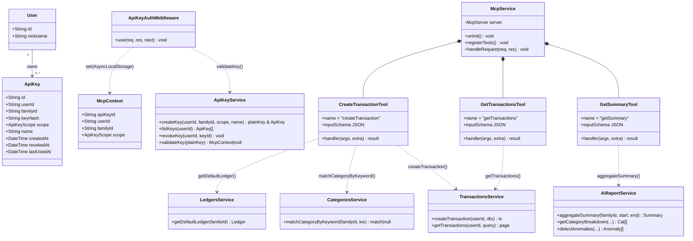
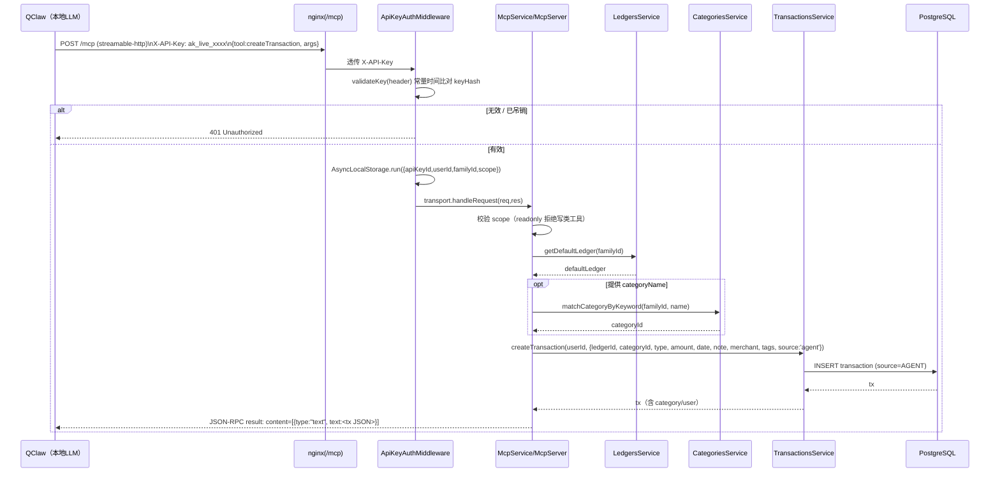
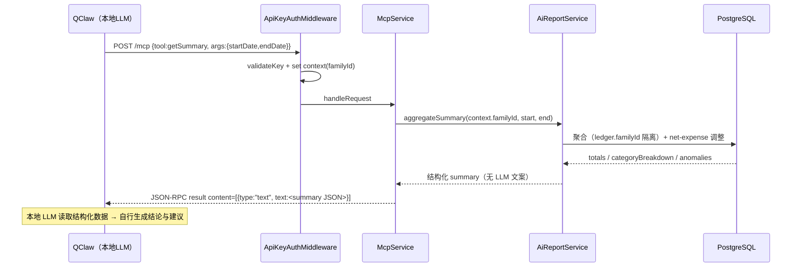
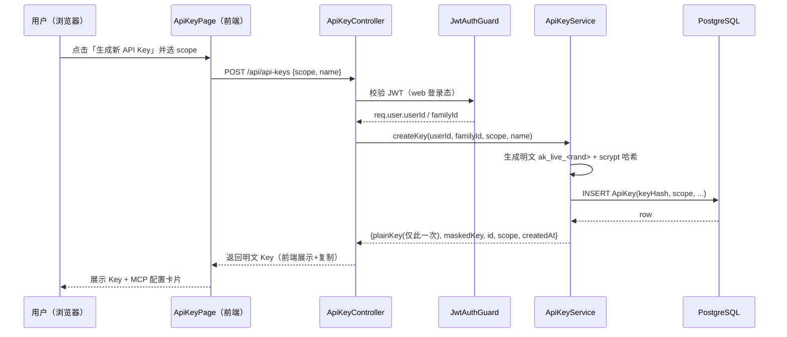
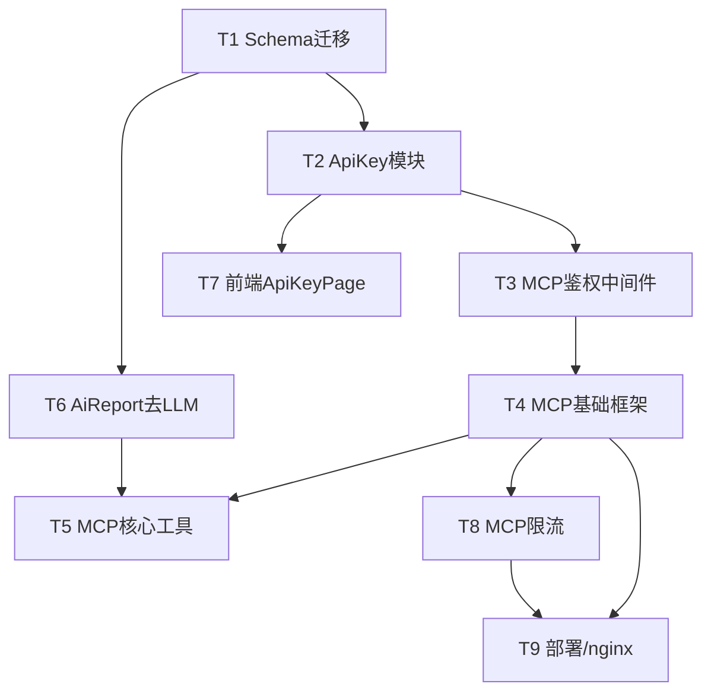

# 架构设计文档：家庭财务 × QClaw 智能体接入（MCP Server + per-user API Key）

> 文档角色：软件架构师 高见远（Gao）
> 阶段：标准 SOP「架构设计」阶段（PRD 已完成：见 `agent-mcp-qclaw-prd.md`；下一阶段为工程师编码）
> 语言：简体中文
> 依赖事实：已直接阅读 `backend/prisma/schema.prisma`、`transactions.service.ts`、`ai-report.service.ts`、`main.ts`、`jwt-auth.guard.ts`、`create-transaction.dto.ts`、`query-transaction.dto.ts`、`app.module.ts`、`ai.module.ts`、`ledgers.service.ts`、`net-expense.ts` 核实，下文据此细化。

---

## 1. 实现方案 + 框架选型

### 1.1 核心难点

| 难点 | 说明 | 应对策略 |
|------|------|----------|
| 机器协议接入 | 后端需暴露一个 MCP 兼容端点，且 QClaw 只认 `streamable-http`（SSE 已淘汰会 401） | 采用官方 `@modelcontextprotocol/sdk` 的 `StreamableHTTPServerTransport` |
| 鉴权模型并存 | 网页用 JWT 登录态；智能体用 per-user API Key，二者必须并存、互不干扰 | 新增 `ApiKeyGuard`（仅作用于 MCP 层），网页 JWT 守卫不动 |
| 零新业务逻辑 | 记账/取数/统计必须复用二期已测 service | MCP Tool 仅做「协议适配 + 权限注入 + 调用 service」，禁止重写领域逻辑 |
| 彻底去 LLM | 后端不再调任何大模型 | `AiReportService` 删除 `QwenProvider` 调用，仅保留纯聚合 |
| 家族数据隔离 | `familyId` 是核心安全边界 | `familyId` 一律由 Key 解析注入，**绝不信任客户端传入** |

### 1.2 框架与库选型

| 维度 | 选型 | 理由 |
|------|------|------|
| MCP SDK | `@modelcontextprotocol/sdk`（Node/TS 原生） | QClaw 同生态；`StreamableHTTPServerTransport` 原生支持 streamable-http |
| MCP 传输 | `StreamableHTTPServerTransport`（无 session 模式 `sessionIdGenerator: undefined`） | 契合 QClaw 凭证注入方式；无状态、随请求建连，规避并发会话问题 |
| MCP 端点挂载 | **原生 Express 中间件**：`app.use('/mcp', apiKeyAuthMiddleware, mcpHandler)` | ① 精确得到 `/mcp`（绕开全局 `api` 前缀）；② 避免全局 `ValidationPipe`/`TransformInterceptor` 干扰 MCP 自有 JSON-RPC 协议；③ 全局 `ThrottlerGuard` 只对 NestJS 路由生效，此处需自定义限流 |
| 鉴权 | 独立 `ApiKeyGuard`（中间件形态）+ `ApiKeyService` | 与网页 `JwtAuthGuard` 解耦；X-API-Key 明文仅回显一次，库存哈希 |
| 哈希 | Node `crypto.scrypt` + `crypto.timingSafeEqual` 恒定时间比较 | 防时序攻击；零新依赖 |
| 限流 | 轻量内存 Map（按 `apiKeyId` 计数）| 家庭场景日调用量极小；单实例足够（多实例见待明确 Q-多实例一致性） |
| 上下文传递 | `AsyncLocalStorage` | 在 `apiKeyAuthMiddleware` 中 `run(mcpContext)`，Tool 处理函数内 `get()`，稳健穿透 streamable-http |
| 前端 | 沿用 React18 + zustand + axios | **零新依赖** |

### 1.3 架构形态（一句话）

后端 = 既有 NestJS 业务系统 + 一个**旁路机器接口层（MCP Module）**；MCP 层不新建业务，只把 QClaw 的自然语言意图翻译成对 `TransactionsService` / `AiReportService` 的调用，并在调用前注入由 `X-API-Key` 解析出的 `familyId/userId/scope`。**理解、结论、对话全部留在 QClaw 侧。**

### 1.4 与 `main.ts` / 现有 bootstrap 的衔接

- 全局 `ValidationPipe`（whitelist+forbidNonWhitelisted）**不变**，但 MCP 端点走原生中间件，不经过该管道（MCP 自带 JSON Schema 校验）。
- `McpModule` 在 `onModuleInit` 中完成：`McpServer` 单例创建 → 注册 3 个工具 → 通过 `app.getHttpAdapter().getInstance()` 把 `mcpHandler` 挂到 `/mcp`。
- 全局前缀 `api` 不影响（原生 `app.use` 路由在 Nest 路由表之外）。

---

## 2. 文件列表（新增/修改，相对项目根）

### 2.1 后端 `backend/`

**数据库 / 迁移**
- `prisma/schema.prisma` — 修改：新增 `ApiKey` 模型；`TransactionSource` 枚举加 `AGENT`
- `prisma/migrations/<ts>_add_apikey_and_agent_source/migration.sql` — 新迁移（PG ENUM 追加值用 `ALTER TYPE ... ADD VALUE`）

**ApiKey 模块（网页侧：JWT 保护）**
- `src/modules/apikey/apikey.module.ts` — 新
- `src/modules/apikey/apikey.service.ts` — 新（生成/哈希/校验/列表/吊销）
- `src/modules/apikey/apikey.controller.ts` — 新（`/api/api-keys`，`@UseGuards(JwtAuthGuard)`）
- `src/modules/apikey/dto/create-apikey.dto.ts` — 新（`scope`、`name`）
- `src/modules/apikey/apikey.guard.ts` — 新（MCP 鉴权中间件 `ApiKeyAuthMiddleware`）

**MCP 模块（机器侧：X-API-Key 保护）**
- `src/modules/mcp/mcp.module.ts` — 新（`onModuleInit` 挂载 `/mcp`）
- `src/modules/mcp/mcp.context.ts` — 新（`McpContext` 类型 + `AsyncLocalStorage` 封装）
- `src/modules/mcp/mcp.service.ts` — 新（`McpServer` 单例 + `registerTools` + `handleRequest`）
- `src/modules/mcp/tools/create-transaction.tool.ts` — 新
- `src/modules/mcp/tools/get-transactions.tool.ts` — 新
- `src/modules/mcp/tools/get-summary.tool.ts` — 新
- `src/modules/mcp/dto/mcp-create-transaction.dto.ts` — 新（**独立于** web `CreateTransactionDto`）
- `src/modules/mcp/dto/mcp-get-transactions.dto.ts` — 新
- `src/modules/mcp/mcp.throttler.middleware.ts` — 新（按 `apiKeyId` 限流，T8）

**复用 / 小改的既有模块**
- `src/modules/ledgers/ledgers.service.ts` — 修改：新增 `getDefaultLedger(familyId)`（返回家庭首个 SHARED 账本；v1 单账本默认）
- `src/modules/ai/ai-report.service.ts` — 修改：删 `QwenProvider` 调用；抽取公开聚合方法 `aggregateSummary` / 公开 `getCategoryBreakdown` / `detectAnomalies`
- `src/modules/ai/ai.module.ts` — 修改：移除 `QwenProvider` provider/export
- `src/modules/ai/providers/qwen.provider.ts` — **删除**（去 LLM 段）
- `src/app.module.ts` — 修改：注册 `ApiKeyModule`、`McpModule`

### 2.2 前端 `frontend/`

- `src/features/settings/ApiKeyPage.tsx` — 新（生成/列表/吊销 + MCP 配置卡片）
- `src/features/settings/ApiKeyGuide.tsx` — 新（P1-05 接入指引步骤）
- `src/features/settings/apikey.store.ts` — 新（zustand）
- `src/features/settings/apikey.api.ts` — 新（axios 封装 `POST /api/api-keys`、`GET`、`DELETE /:id`）
- `src/features/settings/types.ts` — 新（`ApiKey`、`ApiKeyScope` 类型）
- `src/router/index.tsx`（或等价路由文件）— 修改：新增 `/settings/agent-access` 路由

### 2.3 运维

- `nginx` 配置（`family-finance.cloud`）：新增 `location /mcp` 反代到后端 3001，**必须** `proxy_set_header X-API-Key $http_x_api_key`（透传凭证），并允许 POST 与分块/流式响应。

---

## 3. 数据结构和接口（类图 + 契约）

### 3.1 类图（Mermaid）



### 3.2 `ApiKey` 模型（Prisma）

```prisma
model ApiKey {
  id         String     @id @default(uuid())
  userId     String     @map("user_id")
  familyId   String     @map("family_id")   // 冗余存储，便于快速隔离校验
  keyHash    String     @map("key_hash")    // scrypt 哈希，永不明文落库
  scope      ApiKeyScope @default(READWRITE)
  name       String?                      // 用户备注，如「我的龙虾-只读」
  createdAt  DateTime   @default(now()) @map("created_at")
  revokedAt  DateTime?  @map("revoked_at") // 非空即吊销
  lastUsedAt DateTime?  @map("last_used_at")

  user User @relation(fields: [userId], references: [id])

  @@index([userId])
  @@index([familyId])
  @@map("api_keys")
}

enum ApiKeyScope {
  READONLY
  READWRITE
}
```

> 明文 Key 格式：`ak_live_` + 32 字节 `crypto.randomBytes` 的 hex/Base64url。创建时仅随响应返回一次；存储仅 `keyHash = scrypt(plainKey, salt)`。校验：`timingSafeEqual(hash, scrypt(输入, 同salt))`。

### 3.3 `TransactionSource` 枚举迁移

```prisma
enum TransactionSource {
  MANUAL
  QUICK_RECORD
  IMPORT
  VOICE
  AGENT   // 新增：智能体（QClaw / MCP）记账
}
```

### 3.4 MCP Tool 入参 JSON Schema（重点）

> 注：`familyId` **不出现在任何 tool 入参中**——它由 `X-API-Key` 经 `ApiKeyAuthMiddleware` 解析后注入 `McpContext`，Tool 内强制使用，**客户端无法伪造越权**。

**createTransaction**（底层仍调 `transactionsService.createTransaction`，`source` 固定注入 `agent`）
```json
{
  "type": "object",
  "properties": {
    "amount":      { "type": "number", "description": "金额，正数，单位元" },
    "type":        { "type": "string", "enum": ["income", "expense"], "description": "收/支" },
    "categoryName":{ "type": "string", "description": "分类名称（可选）；提供则由服务端按 family 解析为 categoryId" },
    "categoryId":  { "type": "string", "description": "分类ID（可选，优先于 categoryName）" },
    "date":        { "type": "string", "format": "date-time", "description": "交易日期 ISO8601" },
    "merchant":    { "type": "string", "description": "商户名" },
    "note":        { "type": "string", "description": "备注" },
    "tags":        { "type": "array", "items": { "type": "string" } }
  },
  "required": ["amount", "type", "date"]
}
```
> 服务端解析顺序：`categoryId` → 否则 `categoryName` 经 `categoriesService.matchCategoryByKeyword(familyId, name)` → 否则 `categoryId=null`（沿用既有允许空分类）。`ledgerId` 由 `ledgersService.getDefaultLedger(familyId)` 解析（v1 单账本），不入参。`source` 强制 `'agent'`。

**getTransactions**
```json
{
  "type": "object",
  "properties": {
    "page":      { "type": "integer", "minimum": 1, "default": 1 },
    "pageSize":  { "type": "integer", "minimum": 1, "maximum": 100, "default": 20 },
    "type":      { "type": "string", "enum": ["income", "expense", "transfer"] },
    "categoryId":{ "type": "string" },
    "dateFrom":  { "type": "string", "format": "date" },
    "dateTo":    { "type": "string", "format": "date" },
    "minAmount": { "type": "number" },
    "maxAmount": { "type": "number" },
    "keyword":   { "type": "string" },
    "sortBy":    { "type": "string", "enum": ["date", "amount", "createdAt"], "default": "date" },
    "sortOrder": { "type": "string", "enum": ["asc", "desc"], "default": "desc" }
  }
}
```
> 服务端将 `ledgerId` 解析为默认账本后传入既有 `getTransactions(userId, query)`（其内部 `getLedger` 校验归属，保证家族隔离）。

**getSummary**
```json
{
  "type": "object",
  "properties": {
    "startDate": { "type": "string", "format": "date-time" },
    "endDate":   { "type": "string", "format": "date-time" }
  },
  "required": ["startDate", "endDate"]
}
```
> 返回结构化 JSON：`{ totalIncome, totalExpense(net), balance, categoryBreakdown[], anomalies[], period:{start,end} }`，**不含任何 LLM 文案**。结论由 QClaw 本地 LLM 基于该 JSON 生成。

### 3.5 `X-API-Key` Header 契约

```
POST /mcp
Host: family-finance.cloud
Content-Type: application/json
Accept: application/json, text/event-stream
X-API-Key: ak_live_8f3c...（用户在其 QClaw openclaw.json 的 headers 中配置）

Body (MCP JSON-RPC):
{ "jsonrpc":"2.0", "id":1, "method":"tools/call",
  "params":{ "name":"createTransaction",
             "arguments":{ "amount":35, "type":"expense", "categoryName":"餐饮食品", "date":"2025-07-15T12:00:00Z", "note":"买了点肉" } } }
```
- 无效 / 已吊销 Key → `401 Unauthorized`（中间件层直接返回，不进入 `McpServer`）。
- `readonly` Key 调写类工具 → MCP 层返回工具错误（`scope` 校验拒绝），不触达 service。

---

## 4. 程序调用流程（时序图 Mermaid）

### 4.1 场景 A：微信一句话记账（createTransaction）



### 4.2 场景 B：智能体分析（getSummary → 本地出结论）



### 4.3 场景 C：网页生成 API Key（web JWT）



---

## 5. 任务列表（有序、含依赖、按实现顺序）

> 规则：沿依赖链自底向上；T1 无依赖最先；`McpService` 工具实现依赖「框架可用(T4)」与「聚合方法可用(T6)」。

| 任务 | 名称 | 源文件（主要来自 §2） | 依赖 | 优先级 |
|------|------|----------------------|------|--------|
| **T1** | Schema 迁移：新增 `ApiKey` 模型 + `TransactionSource` 加 `AGENT` | `prisma/schema.prisma`、`prisma/migrations/...` | 无 | P0 |
| **T2** | ApiKey 核心模块：生成/哈希/校验/列表/吊销 + web `ApiKeyController`(JWT) + DTO | `apikey.module.ts`、`apikey.service.ts`、`apikey.controller.ts`、`dto/create-apikey.dto.ts` | T1 | P0 |
| **T3** | ApiKeyGuard / MCP 鉴权中间件：`X-API-Key` 解析 → `McpContext` 注入（familyId/userId/scope/apiKeyId），恒定时间比较，吊销即 401 | `apikey/apikey.guard.ts`、`mcp/mcp.context.ts` | T2 | P0 |
| **T4** | MCP 基础框架：`McpModule` + 单例 `McpServer` + `StreamableHTTPServerTransport` 挂载 `/mcp` + `AsyncLocalStorage` 上下文 + 工具注册骨架 | `mcp/mcp.module.ts`、`mcp/mcp.service.ts`、`mcp/mcp.context.ts` | T3 | P0 |
| **T5** | MCP 核心工具实现：`createTransaction` / `getTransactions` / `getSummary`，复用 `transactions.service` & `ai-report.service`，scope 校验，source=AGENT，categoryName 解析 + 默认账本 | `mcp/tools/*.ts`、`mcp/dto/*.ts`、`ledgers.service.ts`(新增 getDefaultLedger) | T4, T6 | P0 |
| **T6** | `AiReportService` 去 LLM 段：删 `QwenProvider` 调用 + 抽取公开聚合方法 `aggregateSummary`/`getCategoryBreakdown`/`detectAnomalies` | `ai-report.service.ts`、`ai.module.ts`、`providers/qwen.provider.ts`(删) | T1 | P0 |
| **T7** | 前端 `ApiKeyPage`：生成/列表/吊销 + MCP 配置卡片 + 接入指引（P1-05） | `frontend/.../settings/*`、`router` | T2 | P0（指引 P1） |
| **T8** | MCP 限流中间件：按 `apiKeyId` 维度（P0 带最小阈值，P1 调阈值） | `mcp/mcp.throttler.middleware.ts` | T4 | P0（最小）/P1 |
| **T9** | 部署与 nginx 配置：`/mcp` 反代 + 透传 `X-API-Key` + 端到端联调（QClaw 实连） | `nginx` 配置、部署脚本 | T4, T8 | P0（上线必需） |

### 5.1 任务依赖图（Mermaid）



---

## 6. 依赖包列表

**后端（新增）**
```
@modelcontextprotocol/sdk   # MCP 协议 + StreamableHTTPServerTransport（Node/TS 原生）
# 说明：SDK 的 tool() 接受 JSON Schema 作为 inputSchema，无需额外引入 zod；
#       @nestjs/throttler 已在 app.module 中，但 MCP 走原生中间件，本期限流用自研轻量中间件（见 T8），不新增依赖。
```

**前端（新增）**
```
无。复用既有 react / zustand / axios；复制功能用 navigator.clipboard。
```

**运维**
```
nginx（既有 family-finance.cloud，复用 HTTPS/SSL，仅新增 /mcp location 反代）
```

---

## 7. 共享知识（跨文件约定，工程师 MUST 遵守）

1. **复用同一套业务 service**：MCP Tool 与 web 接口共用 `TransactionsService` / `AiReportService`，**禁止在 tool 里重写记账/统计逻辑**。Tool 只做协议适配 + 权限注入 + 调用。
2. **`familyId` 一律来自 Key 解析**：`McpContext.familyId` 由 `ApiKeyAuthMiddleware` 从 `X-API-Key` 解析注入，Tool 内强制使用，**绝不读取客户端传入的 familyId**（防越权）。
3. **`source` 统一置 `AGENT`**：经 MCP 创建的交易的 `source` 由 `McpService` 在调用 `createTransaction` 时固定注入 `'agent'`（需 T1 枚举迁移支持）。
4. **Key 明文只回显一次**：创建时返回明文，库存 `scrypt` 哈希；校验用 `crypto.timingSafeEqual` 恒定时间比较；`revokedAt` 非空即视为吊销。
5. **scope 硬隔离**：`readonly` Key 禁止调用写类工具（`createTransaction`/`refundTransaction`/`createRecurring`），仅允许 `get*`；在 Tool 入口统一 `assertWritable(scope)` 校验。
6. **独立 DTO**：MCP 入参走 `mcp/dto/*`（独立 schema），**不与 web `CreateTransactionDto` 混用**；底层仍调同一 service。原因：web DTO 的 `source` 有 `@IsIn(['manual','quick_record','import','voice'])` 校验，会拒绝 `'agent'`，且 web 不允许客户端指定 familyId。
7. **默认账本**：v1 单账本，`getDefaultLedger(familyId)` 返回家庭首个 SHARED 账本；`ledgerId` 不入 MCP 入参。
8. **全局 `ValidationPipe` 白名单不变**；MCP 端点走原生中间件，不经该管道，由 SDK JSON Schema 完成入参校验。
9. **响应形态**：Tool 结果以 `content:[{type:"text", text: <JSON 字符串>}]` 返回；结构化数据即可，无任何自然语言文案（结论归 QClaw）。

---

## 8. 待明确事项（架构层 / 需用户或下一阶段拍板）

| # | 待明确点 | 本架构的暂定建议 | 影响 |
|---|----------|------------------|------|
| Q-阈值 | 限流阈值（P1-03 / T8） | P0 最小阈值建议：单 Key **60 次/分钟、1000 次/天**；P1 再调 | 需用户按家庭场景确认宽松度（参考 PRD Q8） |
| Q-轮换 | Key 吊销/重绑影响（PRD Q6） | v1 仅「硬吊销」；「轮换」暂不做。吊销后 QClaw 配置失效，需用户重新生成并改 `openclaw.json` | 是否提供 soft-rotate 接口待定 |
| Q-回写 | AGENT 来源交易置信度回写（PRD Q7） | MCP `createTransaction` 入参**可选**接收 `aiConfidence` 与 `metadata`（存 LLM 原始文本），便于后续 `ClassificationFeedback` 纠错闭环；v1 不强求 | 是否必填、回写字段结构待定 |
| Q-Webhook | 是否要 Webhook 主动推送（PRD Q4） | P2，本期不做；后端仅被动响应拉取 | 实时提醒诉求留待 P2 |
| Q-多实例 | 限流一致性 | 单实例内存 Map 即可；若未来多副本需换 Redis，T8 中间件预留 `Storage` 接口 | 当前不影响 |
| Q-月报UI | 去 LLM 后 web 月报 `advice` 字段 | `generateMonthlyReport` 改为 `advice: []`（或删生成），需**前端月报模块确认**其渲染兼容空数组 | 跨模块协调（web 月报） |
| Q-nginx | `/mcp` 与既有前端 nginx 共存 | 新增 `location /mcp` 反代到 3001，**务必透传 `X-API-Key` 且允许流式响应**；复用既有 SSL | 运维依赖（T9） |
| Q-AsyncLocalStorage | Tool 取上下文方式 | 推荐 `AsyncLocalStorage`（`apiKeyAuthMiddleware` 注入，`tool handler` 内 `get()`），比依赖 `extra.request` 更稳健 | 工程师实现细节，已定方案 |
| Q-端点路径 | MCP 端点是否独立子域 | 主理人已定：复用 `family-finance.cloud/mcp` 子路径，不新增域名/证书 | 已关闭 |

---

## 9. 风险与缓解

| 风险 | 缓解 |
|------|------|
| `createTransaction` 的 `source` 强制 `'agent'` 在 T1 迁移前会写库失败 | T1 必须最先上线；T5 依赖 T1 |
| 全局 `ThrottlerGuard` 不覆盖原生 `/mcp` 路由 | T8 自研按 Key 中间件；T4 挂载时显式串联 |
| `getTransactions` 既有实现按 `ledgerId` 过滤、不直接约束 familyId | MCP 层先解析默认账本再传 `ledgerId`，由 `getLedger` 完成家族归属校验 |
| 多实例部署限流不一致 | T8 中间件预留可替换 Storage（Redis） |
| web 月报因 `advice` 置空渲染异常 | 在 T6 同步知会前端月报模块（见 Q-月报UI） |

---

> 文档结束。本设计**不编写任何业务代码**，仅输出架构与任务分解，供工程师（下一阶段）按 T1→T9 顺序编码。
