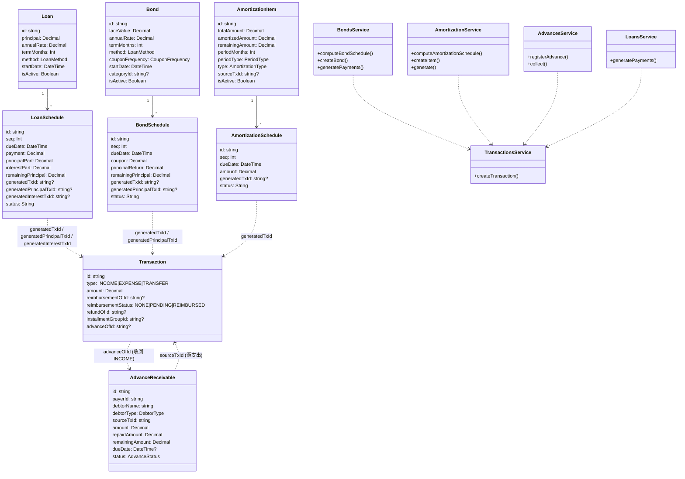
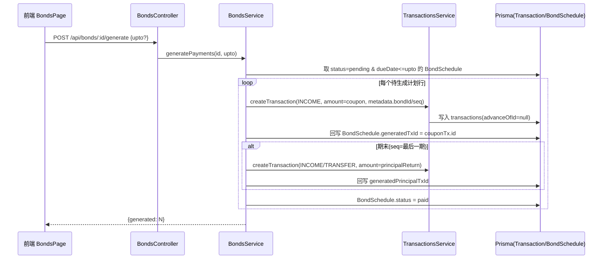
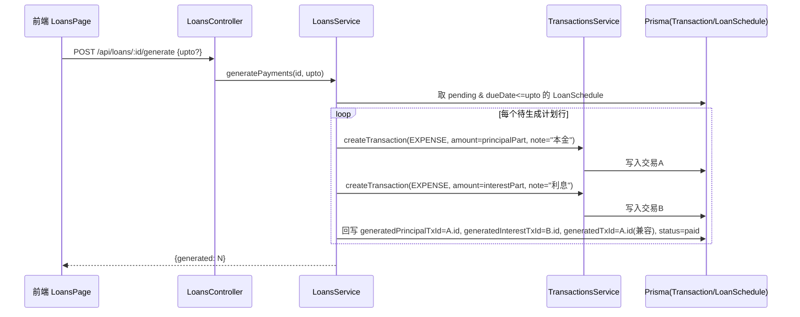
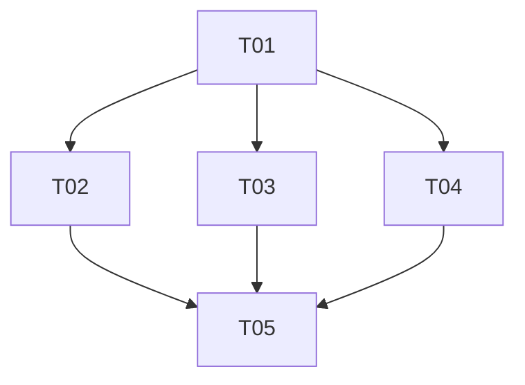

# 「债务/债券板块」系统架构设计 + 任务分解

> 架构师：高见远。本文档不改动任何现有文件，仅给出设计与任务拆解（[新增]/[改动] 为设计意图）。
> 事实基础：已确认 PRD `deliverables/software-company/debt-bond-section-prd-2026-07-15.md` + 4 项用户硬决策 + 代码盘点（`schema.prisma`、`loans.service.ts`、`recurring.service.ts`、`transactions.service.ts`、`net-expense.ts`、前端 `LoansPage.tsx`/`Sidebar.tsx`/`App.tsx`/`constants.ts`/`types/transaction.ts`）。
> 状态：**待用户确认**（2026-07-15）。确认后进入编码（寇豆码）→ QA（严过关）。

---

## 一、实现方案 + 框架选型

**技术栈（沿用，无新增框架）**：后端 NestJS 10 + Prisma 5 + PostgreSQL；前端 React 18 (Vite + Tailwind + shadcn/ui) + TanStack Query。金额沿用现有约定：数据库 `Decimal(12,2)/(14,2)`，服务层以 `number` + `round2`（四舍五入 2 位）处理。

**统一「Schedule 范式」（核心复用点）**：`Bond`/`BondSchedule`、`AmortizationItem`/`AmortizationSchedule` 与现有 `Loan`/`LoanSchedule` **完全同构**，遵循同一生命周期：
1. **创建即算全表**：`createXxx` 时按算法一次性算出完整计划行（seq/dueDate/金额/剩余），`createMany` 写入 `*_schedules`，状态 `pending`。
2. **generate 游标生成**：`POST /api/:module/:id/generate {upto?}` 取 `status=pending && dueDate<=upto` 的行，逐条调用 `TransactionsService.createTransaction(...)` 落 `transactions` 表，回写 `generatedTxId`(们)，状态置 `paid`/`posted`。
3. **算法各自实现**：贷款=本息拆解（`loans.service.ts` 已验证的 `computeSchedule`，等额本息/本金）；债券=票息曲线（持有方每期票息 INCOME，期末返还面值）；待摊/预付=平摊 `totalAmount/periodMonths`。算法小（~30 行），**不抽公共 util**，各 service 内联以保持与现有代码一致、降低耦合。

**为何不复用 `RecurringRule` 表做待摊/预付调度**：`RecurringRule` 是「开放式、无限期、固定金额」规则，而待摊/预付是「有总额、有期数、余额递减、需时间轴预览」的封闭计划。若复用其表会产生语义错位。故**待摊/预付复用的是 RecurringService 的「游标推进/幂等」思想，而落地为与 LoanSchedule 同构的 `AmortizationSchedule` 预计算表**——既保证 UI 时间轴预览一致，又避免跨模块耦合。

**前端接入通用布局**：三个新页面 `BondsPage`/`AmortizationPage`/`AdvancesPage` **逐字镜像 `LoansPage.tsx`** 三段式布局（左列表 + 右详情/时间轴 + 新建 Dialog），复用 `Card/Button/Dialog/Table/Badge/Select/Input/Label`（`@/components/ui`）与 `useQuery/useMutation`；API 客户端镜像 `services/loan.service.ts`。导航收拢：扩展 `lib/constants.ts` 的 `NAV_ITEMS` 支持分组，在 `Sidebar.tsx` 渲染「债务/债券」分组（债券/待摊预付/垫付/报销），并在 `App.tsx` 注册三条懒加载路由。

**4 项决策如何收敛设计**：
- 决策①债券仅 HELD：`Bond` **去掉 `side` 字段**，票息 = INCOME（利息收入）；期末本金返还另算一笔（INCOME/TRANSFER 待定，见待明确）。
- 决策②利息拆独立交易：贷款 generate 改「本金 EXPENSE + 利息 EXPENSE」两笔；`LoanSchedule` 新增 `generatedPrincipalTxId` + `generatedInterestTxId`（`generatedTxId` 保留指向本金，向后兼容）。
- 决策③报销=统计排除：Net Expense/仪表盘排除 `reimbursementStatus=REIMBURSED` 的金额；**交易列表仍显示该笔**（不改展示层）。
- 决策④垫付归还生成收款：`POST /api/advances/:id/collect` 生成 INCOME 交易（`advanceOfId` 关联），支持部分归还，更新 `repaidAmount/remainingAmount/status`。

---

## 二、文件列表及相对路径

### 后端（NestJS）
**数据模型 / 基础设施**
- `backend/prisma/schema.prisma` **[改动]** — 新增 `Bond`/`BondSchedule`/`AmortizationItem`/`AmortizationSchedule`/`AdvanceReceivable` 模型 + 枚举（`CouponFrequency`/`AmortizationType`/`PeriodType`/`DebtorType`/`AdvanceStatus`）；`Transaction` 新增 `advanceOfId?`；`LoanSchedule` 新增 `generatedPrincipalTxId?`/`generatedInterestTxId?`；`Family`/`Ledger`/`User` 增加反向关系列表。
- `backend/prisma/migrations/<ts>_debt_bond_section/` **[新增]** — `prisma migrate dev` 自动生成（非手写）。
- `backend/src/app.module.ts` **[改动]** — 注册 `BondsModule`/`AmortizationModule`/`AdvancesModule`。

**债券模块 bonds/**
- `backend/src/modules/bonds/bonds.module.ts` **[新增]**
- `backend/src/modules/bonds/bonds.controller.ts` **[新增]**
- `backend/src/modules/bonds/bonds.service.ts` **[新增]** — `computeBondSchedule`（票息算法）、CRUD、`generatePayments`（票息 INCOME + 期末本金返还）。
- `backend/src/modules/bonds/dto/create-bond.dto.ts` **[新增]** — `CreateBondDto`/`UpdateBondDto`/`GenerateBondDto`。

**待摊/预付模块 amortizations/**
- `backend/src/modules/amortizations/amortization.module.ts` **[新增]**
- `backend/src/modules/amortizations/amortization.controller.ts` **[新增]**
- `backend/src/modules/amortizations/amortization.service.ts` **[新增]** — `computeAmortizationSchedule`（平摊）、CRUD、`generate`（摊销 EXPENSE + 递减 `remainingAmount`）、初始入账 EXPENSE。
- `backend/src/modules/amortizations/dto/create-amortization.dto.ts` **[新增]** — `CreateAmortizationDto`/`UpdateAmortizationDto`/`GenerateAmortizationDto`。

**垫付模块 advances/**
- `backend/src/modules/advances/advances.module.ts` **[新增]**
- `backend/src/modules/advances/advances.controller.ts` **[新增]**
- `backend/src/modules/advances/advances.service.ts` **[新增]** — 登记（EXPENSE + `AdvanceReceivable`）、`collect`（INCOME + 更新余额/状态）、CRUD。
- `backend/src/modules/advances/dto/create-advance.dto.ts` **[新增]** — `CreateAdvanceDto`/`CollectAdvanceDto`/`UpdateAdvanceDto`。

**现有文件改动**
- `backend/src/modules/loans/loans.service.ts` **[改动]** — `generatePayments` 改双笔（本金+利息 EXPENSE）并回写 `generatedPrincipalTxId`/`generatedInterestTxId`；`createRepaymentTransaction` 拆为两函数。
- `backend/src/modules/transactions/dto/create-transaction.dto.ts` **[改动]** — 新增 `advanceOfId?` 透传入参（供 collect 反向交易使用）。
- `backend/src/modules/transactions/transactions.service.ts` **[改动]** — `createTransaction` 落 `advanceOfId` 字段（极小改动，其余不变）。
- `backend/src/common/statistics/net-expense.ts` **[改动]** — 新增 `sumReimbursedAmount()`；`calcNetExpense(gross, refund, reimbursed)` 排除 REIMBURSED。
- `backend/src/modules/dashboard/dashboard.service.ts` **[改动]** — 净支出调用新 `calcNetExpense`；P2 增加负债/应收/待摊卡片（见任务 T05）。

### 前端（React）
- `frontend/src/types/transaction.ts` **[改动]** — 新增 `Bond`/`BondSchedule`/`AmortizationItem`/`AmortizationSchedule`/`AdvanceReceivable` 类型；`Transaction` 增加 `advanceOfId?`。
- `frontend/src/services/bond.service.ts` **[新增]** — 对齐 `loan.service.ts`（list/create/getSchedules/generate/delete）。
- `frontend/src/services/amortization.service.ts` **[新增]**
- `frontend/src/services/advance.service.ts` **[新增]**
- `frontend/src/features/bonds/BondsPage.tsx` **[新增]** — 镜像 LoansPage（列表+票息时间轴+新建表单实时预览首期票息）。
- `frontend/src/features/amortizations/AmortizationPage.tsx` **[新增]** — 列表（剩余余额进度条/剩余期数）+ 时间轴 + 生成本期。
- `frontend/src/features/advances/AdvancesPage.tsx` **[新增]** — 列表（债务人/已收回/未收回/状态，未收回筛选）+ 详情（源支出+收款流水）+ 登记收回弹窗。
- `frontend/src/features/reimbursements/ReimbursementsPage.tsx` **[改动]** — 「未报销」Tab（PENDING）默认 + 角标计数；配合决策③统计联动。
- `frontend/src/features/transactions/TransactionListPage.tsx` **[改动]** — 记账表单新增「垫付」开关+债务人字段（提交调 `POST /api/advances`，自动登记应收）；「报销」开关（提交后调 `markReimbursement` 置 PENDING）。
- `frontend/src/lib/constants.ts` **[改动]** — `ROUTES` 增 `BONDS/AMORTIZATIONS/ADVANCES`；`NAV_ITEMS` 支持 `group` 字段并新增 3 项归入「债务/债券」分组（报销已在）。
- `frontend/src/App.tsx` **[改动]** — 注册 `/bonds` `/amortizations` `/advances` 懒加载路由。
- `frontend/src/components/layout/Sidebar.tsx` **[改动]** — 按 `group` 渲染分组标题。

---

## 三、数据结构与接口（类图）



### 全部新增 REST 接口
**Bonds**
- `GET /api/bonds?familyId=` → `Bond[]`（含 `schedules`）
- `POST /api/bonds` `{ledgerId, accountId?, name, faceValue, annualRate, termMonths, method, couponFrequency, startDate, categoryId?}` → 创建并算全表
- `GET /api/bonds/:id` → `Bond`(+schedules)
- `PUT /api/bonds/:id` → 改参数（未生成前可重算）
- `DELETE /api/bonds/:id`
- `POST /api/bonds/:id/generate {upto?}` → `{generated}`（每期票息 INCOME；期末额外本金返还交易）

**Amortizations**
- `GET /api/amortizations?familyId=` → `AmortizationItem[]`（含 `schedules`, `remainingAmount`）
- `POST /api/amortizations` `{ledgerId, accountId?, name, totalAmount, periodMonths, type, categoryId?, startDate, note?}` → 初始入账 EXPENSE(`sourceTxId`) + 算全表
- `GET /api/amortizations/:id`
- `PUT /api/amortizations/:id`
- `DELETE /api/amortizations/:id`
- `POST /api/amortizations/:id/generate {upto?}` → `{generated}`（每期摊销 EXPENSE，递减 `remainingAmount`）

**Advances**
- `GET /api/advances?familyId=&status?` → `AdvanceReceivable[]`
- `POST /api/advances` `{ledgerId, accountId?, payerId, debtorName, debtorType, amount, sourceTxId, dueDate?, note?}` → 创建源 EXPENSE 交易 + `AdvanceReceivable`
- `GET /api/advances/:id`
- `PUT /api/advances/:id`
- `DELETE /api/advances/:id`
- `POST /api/advances/:id/collect` `{amount, date, accountId?}` → 生成 INCOME(`advanceOfId`) + 更新 `repaidAmount/remainingAmount/status`（支持部分归还）

### 对现有接口的改动点
- `POST /api/loans/:id/generate`：**行为变更**——由「单笔 EXPENSE」改为「本金 EXPENSE + 利息 EXPENSE 两笔」，回写 `generatedPrincipalTxId`+`generatedInterestTxId`（DTO 不变，仅 service 内部逻辑变）。
- `POST /api/transactions`：**入参新增** `advanceOfId?`（仅垫付收回反向交易使用；垫付登记走 `/api/advances` 而非此接口）。
- `POST /api/transactions/:id/reimbursement/{mark,cancel,confirm}`：**不改**，仅统计层（net-expense）按决策③排除 REIMBURSED。

---

## 四、程序调用流程（时序图，4 条）

### ① 债券每期票息生成


### ② 贷款还款生成（决策②：双笔）


### ③ 待摊/预付每期摊销
```mermaid
sequenceDiagram
    participant U as 前端 AmortizationPage
    participant AC as AmortizationController
    participant AS as AmortizationService
    participant TS as TransactionsService
    participant DB as Prisma(Transaction/AmortizationItem/Schedule)
    U->>AC: POST /api/amortizations/:id/generate {upto?}
    AC->>AS: generate(id, upto)
    AS->>DB: 取 pending & dueDate<=upto 的 AmortizationSchedule
    loop 每个待生成计划行
        AS->>TS: createTransaction(EXPENSE, amount=schedule.amount, metadata.itemId/seq)
        TS->>DB: 写入摊销交易
        AS->>DB: 回写 AmortizationSchedule.generatedTxId, status=posted
        AS->>DB: AmortizationItem.amortizedAmount += amount; remainingAmount -= amount; 若<=0 → isActive=false
    end
    AS-->>U: {generated: N}
```

### ④ 垫付登记 + 收回
```mermaid
sequenceDiagram
    participant U as 前端 TransactionListPage/AdvancesPage
    participant AC as AdvancesController
    participant AS as AdvancesService
    participant TS as TransactionsService
    participant DB as Prisma(Transaction/AdvanceReceivable)
    U->>AC: POST /api/advances {amount, debtorName, debtorType, sourceTxId,...}
    AC->>AS: registerAdvance(dto)
    AS->>TS: createTransaction(EXPENSE, amount, note="垫付:债务人")
    TS->>DB: 写入源支出交易
    AS->>DB: 创建 AdvanceReceivable(sourceTxId, amount, remainingAmount=amount, status=PENDING)
    AS-->>U: AdvanceReceivable
    U->>AC: POST /api/advances/:id/collect {amount, date, accountId?}
    AC->>AS: collect(id, dto)
    AS->>TS: createTransaction(INCOME, amount, advanceOfId=adv.id)
    TS->>DB: 写入收款交易
    AS->>DB: repaidAmount+=amount; remainingAmount-=amount; status = remaining<=0?RECOVERED:PARTIAL
    AS-->>U: {repaidAmount, remainingAmount, status}
```

---

## 五、任务列表（有序、含依赖、按实现顺序）

**T01 [P0] 基础设施：数据模型 + 迁移 + 模块注册 + 共享类型**
- 文件：`backend/prisma/schema.prisma`[改动]、`backend/prisma/migrations/..._debt_bond_section/`[新增]、`backend/src/app.module.ts`[改动]、`frontend/src/types/transaction.ts`[改动]
- 依赖：无
- 验收：① `prisma validate` 通过；② `prisma migrate dev` 生成迁移且可 `prisma generate`；③ 三个新 Module 已在 `app.module.ts` 注册；④ 前端类型编译通过。

**T02 [P0] 垫付模块（Advances）**
- 文件：`backend/src/modules/advances/*`(module/controller/service/dto)[新增] ×5、`backend/src/modules/transactions/dto/create-transaction.dto.ts`[改动]、`frontend/src/services/advance.service.ts`[新增]、`frontend/src/features/advances/AdvancesPage.tsx`[新增]、`frontend/src/features/transactions/TransactionListPage.tsx`[改动]
- 依赖：T01
- 验收：① 记账表单「垫付」开关→调用 `/api/advances` 后列表出现应收且 `remainingAmount=amount`；② `collect` 部分归还后 `status=PARTIAL`、收款 INCOME 交易 `advanceOfId` 正确；③ 全部收回 `status=RECOVERED`、remaining=0；④ 源支出不重复计入应收。

**T03 [P0] 报销口径 + 未报销视图（决策③落地）**
- 文件：`backend/src/common/statistics/net-expense.ts`[改动]、`backend/src/modules/dashboard/dashboard.service.ts`[改动]、`frontend/src/features/reimbursements/ReimbursementsPage.tsx`[改动]、`frontend/src/features/transactions/TransactionListPage.tsx`[改动]
- 依赖：T01
- 验收：① `calcNetExpense` 对 `reimbursementStatus=REIMBURSED` 的支出不再计入净支出；② 交易列表仍显示该笔；③ 报销页「未报销」Tab 默认展示 PENDING 且有角标计数；④ 记账表单「报销」开关→`markReimbursement` 置 PENDING。

**T04 [P0] 待摊/预付 + 债券模块 + 统一导航**
- 文件：`backend/src/modules/bonds/*`[新增]×4、`backend/src/modules/amortizations/*`[新增]×4、`backend/src/modules/loans/loans.service.ts`[改动]、`frontend/src/services/bond.service.ts`[新增]、`frontend/src/services/amortization.service.ts`[新增]、`frontend/src/features/bonds/BondsPage.tsx`[新增]、`frontend/src/features/amortizations/AmortizationPage.tsx`[新增]、`frontend/src/lib/constants.ts`[改动]、`frontend/src/App.tsx`[改动]、`frontend/src/components/layout/Sidebar.tsx`[改动]
- 依赖：T01
- 验收：① 债券创建算全表、generate 每期生成票息 INCOME；② 贷款 generate 改双笔（本金+利息 EXPENSE）且回写双字段、已生成行不重复；③ 待摊创建生成初始 EXPENSE + 全表，generate 每期摊销 EXPENSE 并递减 remaining；④ 侧栏出现「债务/债券」分组，3 条新路由可访问；⑤ 三页列表/详情/新建交互与 LoansPage 一致。

**T05 [P2] 统计联动与板块汇总**
- 文件：`backend/src/modules/debt-bond/debt-bond.controller.ts`+`service.ts`+`module.ts`[新增]（或并入 dashboard）、`backend/src/modules/dashboard/dashboard.service.ts`[改动]、`frontend/src/features/dashboard/DashboardPage.tsx`[改动]、`backend/src/modules/loans/loans.service.ts`[改动]（批量生成端点 P2-3）
- 依赖：T02, T03, T04
- 验收：① `GET /api/debt-bond/summary` 返回 总负债/总应收/本月利息支出/未摊销余额；② 仪表盘新增「负债/应收/待摊」卡片且数据正确；③ 批量生成接口可一键生成所有到期计划。

### 任务依赖图


---

## 六、依赖包列表

**无**。后端复用 NestJS/Prisma/Decimal（Prisma 原生 Decimal 已覆盖）；前端复用现有 React/TanStack Query/shadcn/lucide。三个新模块均为「范式内增件」，不引入新依赖。

---

## 七、共享知识（跨文件约定）

1. **Schedule → Transaction 回写模式**：所有周期性条目统一通过 `*.generate` 取 `status=pending && dueDate<=upto` 的行 → `TransactionsService.createTransaction(...)` 落表 → 回写 `generatedTxId`(们) → `status=paid/posted`。`generatedTxId` 非空 + `status!=pending` 即「已生成」，保证幂等、避免重复。
2. **Transaction.type 枚举**：仅 `INCOME | EXPENSE | TRANSFER`；债券票息=INCOME、摊销/还本付息=EXPENSE、垫付源支出=EXPENSE、垫付收回=INCOME。TRANSFER 仅用于「内部转账」预留（债券期末本金返还是否用 TRANSFER 见待明确）。
3. **金额 Decimal 约定**：DB `Decimal(12,2)`/`(14,2)`；service 层 `number` + `round2(n)=Math.round(n*100)/100`；DTO 入参 `@IsNumber({maxDecimalPlaces:2})`；分期/摊销末期满额校正沿用「末期校正」写法。
4. **net-expense 排除规则（决策③）**：`calcNetExpense(grossExpense, refundInScope, reimbursedInScope) = gross - refund - reimbursed`；Dashboard/月报/预算三处统一调用 `calcNetExpense` + `sumRefundAmount` + 新增 `sumReimbursedAmount`（聚合 `type=EXPENSE && reimbursementStatus=REIMBURSED`）。报销 INCOME 仍计入总收入、不冲减支出。
5. **前端列表/详情/新建通用布局约定**：新页面三段式（左列表 + 右详情/时间轴 + 新建 Dialog），复用 `@/components/ui` 原子组件与 `useQuery/useMutation`；API 客户端 `get/post/del` 来自 `@/services/api`；类型集中在 `@/types/transaction.ts`；`formatCurrency/formatDate` 来自 `@/lib/utils`。
6. **周期生成与 nextRunAt 游标约定**：开放式周期用 `RecurringRule.nextRunAt`；本期债券/待摊为**封闭计划**，用「创建即算全表 + generate 按 dueDate 游标」替代 nextRunAt，UI 可预览全时间轴；二者互不耦合。
7. **家庭隔离**：所有写操作经 `familiesService.validateFamilyMember(familyId, userId)` + `ledgersService.getLedger` 校验；列表按 `familyId` 过滤。
8. **事件驱动**：`createTransaction` 已自动发 `transaction.created` 等事件并校正账户余额；新模块只需调 `createTransaction`，无需重复实现余额/WS 逻辑。

---

## 八、待明确事项（需用户/PM 拍板）

1. **债券期末本金返还交易类型**：HELD 债券到期返还面值，用 `INCOME` 还是 `TRANSFER`？建议 `INCOME`（视为本金回收收入）。影响 `BondSchedule.generatedPrincipalTxId` 对应交易的 `type`。
2. **待摊初始入账口径**：预付年费初始付款，是 (a) 直接记 EXPENSE（简单，本期采用）还是 (b) 先记资产（预付款）再逐期摊销转出？决策②关联此点；若选 (b) 需额外资产账户/分类约定。
3. **双笔利息交易的 `generatedTxId` 表示**：建议 `LoanSchedule.generatedTxId` 保留指向本金（向后兼容旧数据），新增 `generatedPrincipalTxId`+`generatedInterestTxId` 分别指向两笔。是否接受此双列方案，或改为 JSON 数组？
4. **部分归还精度/四舍五入**：垫付/报销部分归还时末次金额校正采用「末期校正」（末笔 = 剩余额）还是「允许 1 分误差」？建议末期校正，与分期一致。
5. **债券票息频率与还款方式映射**：`couponFrequency`(MONTHLY/QUARTERLY/SEMI/ANNUAL) 与 `method`(等额本息/本金) 对持有方票息曲线的影响——持有方通常票息固定，`method` 是否仅用于未来扩展？建议本期 `method` 仅占位、票息按 `annualRate/期数` 平摊。
6. **报销「不计入支出」是否仅限 Net Expense**：决策③已定「统计排除、列表仍显示」，但仪表盘「本月利息支出」聚合是否也需排除报销类？建议统一以 `calcNetExpense` 为唯一口径。

— 完 —

## 修订记录（用户确认后，2026-07-15）
基于用户硬决策①与 PM 拍板，相对初稿采纳以下修订（**HELD-only 为最终范围**）：
1. 债券期末本金返还 = INCOME（HELD 外部现金流入）；Bond 无 `side` 字段，仅 HELD。
2. 待摊初始入账 = 直接 EXPENSE（无 `amortizationItemId`，计入净支出）；每期摊销 = EXPENSE 带 `amortizationItemId`，Net Expense 中排除（新增 `sumAmortizationAmount`）。
3. 双笔利息字段 = 两列法：`LoanSchedule`/`BondSchedule` 保留 `generatedTxId`(指向本金) + 新增 `generatedInterestTxId?`(指向利息)；不新增 `generatedPrincipalTxId`、不用 JSON。
4. 部分归还精度 = 末期校正（末笔=精确剩余额）。
5. 债券票息 = 固定票息(bullet)：`periodCoupon = faceValue × annualRate / 付息期数`；`method` 仅占位；每期 `interestPart=periodCoupon`、`principalPart=0`，仅末期 `principalPart=faceValue`。
6. 报销/摊销排除 = 统一 `calcNetExpense` 单一真源：`calcNetExpense(gross, refund, reimbursed, amortized) = gross - refund - reimbursed - amortized`；新增 `sumReimbursedAmount`/`sumAmortizationAmount` 与 `sumRefundAmount` 并列。
- **冲突裁决**：PM 误引 ISSUED 视角，用户硬决策①为「仅持有方(HELD)」，本期不做发行方。Bond 模型无 `side` 字段。
