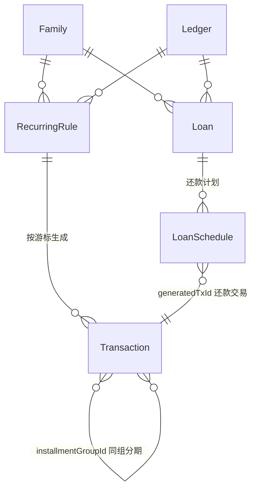
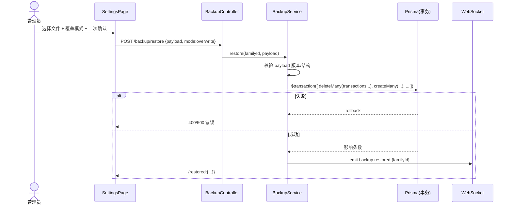
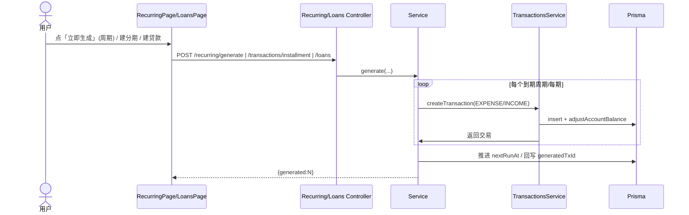
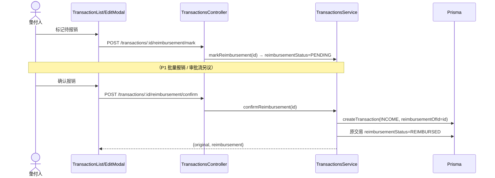
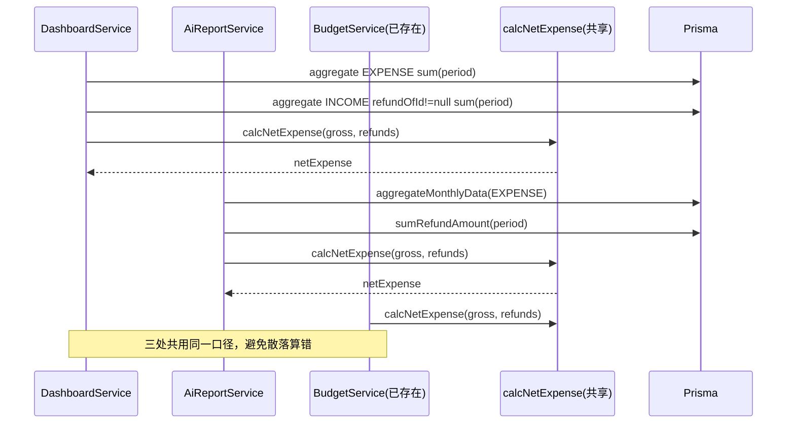

# 家庭财务 Web 应用 · 第二期系统架构设计

> 作者：架构师 高见远（Gao）
> 日期：2026-07-12
> 配套：PRD `phase2-prd.md`、现有代码（已核对）
> 范围：仅架构设计 + 任务拆解，**未写任何代码、未改任何源文件**

---

## 0. 代码核对结论（已逐条核对，作为设计基线）

| # | 核对项 | 结论（基于实际代码） | 对设计的影响 |
|---|---|---|---|
| 0.1 | `Transaction` 模型字段 | `schema.prisma:139` 无退款/报销/分期/周期列；预留 `metadata(Json?)`、`tags(String[])`、`accountId?`、`currency` | 加列需走迁移；新列必须可空/有默认值，保证向后兼容 |
| 0.2 | `ValidationPipe` | `main.ts:40` `whitelist:true, forbidNonWhitelisted:true` **已确认** | 任何新请求体字段必须在 DTO 显式声明，否则 400 |
| 0.3 | 迁移命名 | `00000000000000_<name>/migration.sql`，`@@map` 复数 snake_case | 新表/列迁移严格遵循现有命名 |
| 0.4 | 接口风格 / 路由顺序 | `categories.controller.ts:43` `PUT('reorder')` 先于 `PUT(':id')`；`transactions.controller.ts` 的 `quick/batch/clear` 先于 `:id` | 我所有新静态路由一律声明在 `:id` 之前 |
| 0.5 | 调度模块 | `app.module.ts:54` **`ScheduleModule.forRoot()` 已注册** | 方案 A（后端 cron）**零新增依赖**即可启用；P0 仍可只做手动生成 |
| 0.6 | 统计聚合落点 | `DashboardService`（summary/budget/trend/category/member 共 5 处）+ `AiReportService`（aggregateMonthlyData / getCategoryBreakdown 共 2 处）均按 `type='EXPENSE'` 求和 | 「净支出统一口径」改造点已精确定位（见 §3.4、§7.2） |
| 0.7 | familyId 隔离 | 统一通过 `ledger.familyId` 过滤（`transactions.service` 用 `where:{ledger:{familyId}}`） | 新聚合/恢复必须沿用该隔离方式 |
| 0.8 | 账户余额校正 | `adjustAccountBalance`（transactions.service:590）已处理 收入+/支出−、信用卡取反、可用额度重算 | 退款/报销/分期/还款交易只要带 `accountId`，余额逻辑**自动复用**，无需重写 |
| 0.9 | 前端 UI 落点 | `SettingsPage.tsx` 数据管理 Tab 导出为 mock（`handleExportData` 仅返回 `{user}`）；`EditTransactionModal.tsx` 仅有金额/日期/类型/账户/分类/商户/备注；`TransactionListPage.tsx` 含筛选+`BatchOperations` | 备份/退款/报销 UI 均有清晰嵌入点 |
| 0.10 | 依赖可用性 | `dayjs`、`nanoid` 已在后端使用；前端 `lucide-react`、`react-query` 完备；图表组件 `components/charts` 已存在 | 二期 P0 **几乎零新增依赖**（见 §6） |

---

## 1. 总体实现方案与框架选型

### 1.1 四模块实现思路

| 模块 | 核心思路 | 是否新表 | 是否新列 | 关联生成方式 |
|---|---|---|---|---|
| ① 备份与恢复 | 导出=只读聚合（零写入）；恢复=单 family 事务包裹的 `clear→insert`；P0 仅覆盖模式、密钥不离端（加密放前端） | 可选 `BackupRecord`（P1） | 否 | — |
| ② 周期/分期/按揭 | 周期=`RecurringRule` 表 + `nextRunAt` 游标生成；分期=复用 `Transaction` 加 3 列、一次生成 N 笔；按揭=`Loan`+`LoanSchedule` 两表 + 标准算法生成还款交易 | `RecurringRule`、`Loan`、`LoanSchedule` | `installmentGroupId/seq/total` | 反向/周期交易均复用 `createTransaction` |
| ③ 退款 | 反向 `INCOME` 交易 + 原交易 `refundStatus/refundedAmount`；统计层「净支出=原额−退款」统一口径 | 否 | `refundOfId/refundedAmount/refundStatus` | 反向交易带 `refundOfId` |
| ④ 报销 | 状态标记 + 反向 `INCOME` 交易；通过 `reimbursementOfId/reimbursementStatus` 与退款区分 | 否 | `reimbursementOfId/reimbursementStatus` | 反向交易带 `reimbursementOfId` |

> **统一反向交易约定（设计已定）**：退款与报销都产生 `type=INCOME` 的反向交易，但**仅靠关联列区分**——退款用 `refundOfId`，报销用 `reimbursementOfId`。**不新增 `TransactionSource` 枚举值**（避免 `ALTER TYPE` 迁移风险），反向交易 `source` 复用 `manual`。详见 §7.1。

### 1.2 框架 / 依赖选型

- **后端调度**：沿用已注册的 `@nestjs/schedule`。P0 不启用常驻 cron，仅暴露「手动生成」接口；预留 `@Cron()` 处理器（注释禁用），用户拍板方案 A 后即可一键开启。
- **前端加密（P1 加密导出）**：**推荐原生 Web Crypto API（AES-GCM）**，口令永不传服务端，**零 npm 依赖**。仅在团队不接受 Web Crypto 时退用 `crypto-js`。
- **日期/游标计算**：复用已安装的 `dayjs`，不新增依赖。
- **ID 生成**：新表主键用 Prisma `@default(uuid())`；跨家庭恢复重映射在前端/后端恢复逻辑里用新 uuid 重建映射。
- **不引入** 消息队列、对象存储 SDK（P2 云盘存储另议）。

### 1.3 Prisma Schema 变更方案

> 全部为**可空或带默认值**的新增，不影响现有 `CreateTransactionDto`（满足 whitelist 向后兼容）。

**新增枚举**（追加在 `schema.prisma` 枚举区）：

```prisma
enum Frequency {
  DAILY
  WEEKLY
  MONTHLY
  YEARLY
}

enum LoanMethod {
  EQUAL_INSTALLMENT // 等额本息
  EQUAL_PRINCIPAL   // 等额本金
}

enum RefundStatus {
  NONE
  PARTIAL
  FULL
}

enum ReimburseStatus {
  NONE
  PENDING
  REIMBURSED
}
```

**`Transaction` 模型新增列**（接在 `accountId` 之后，`@@index` 区补索引）：

```prisma
  // ===== 二期扩展列（均可空/有默认值，向后兼容） =====
  installmentGroupId  String?  @map("installment_group_id") // 同组分期标识
  installmentSeq      Int?     @map("installment_seq")       // 第几期（1..N）
  installmentTotal    Int?     @map("installment_total")     // 总期数
  refundOfId          String?  @map("refund_of_id")          // 指向原支出（反向退款交易）
  refundedAmount      Decimal? @default(0) @db.Decimal(12, 2) @map("refunded_amount")
  refundStatus        RefundStatus @default(NONE) @map("refund_status")
  reimbursementOfId   String?  @map("reimbursement_of_id")   // 指向原支出（报销收入交易）
  reimbursementStatus ReimburseStatus @default(NONE) @map("reimbursement_status")

  // 索引（放在 @@index 区）
  @@index([installmentGroupId])
  @@index([refundOfId])
  @@index([reimbursementOfId])
```

**新增表** `RecurringRule` / `Loan` / `LoanSchedule`：

```prisma
model RecurringRule {
  id         String   @id @default(uuid())
  familyId   String   @map("family_id")
  ledgerId   String   @map("ledger_id")
  userId     String   @map("user_id")
  categoryId String?  @map("category_id")
  accountId  String?  @map("account_id")
  type       TransactionType
  amount     Decimal  @db.Decimal(12, 2)
  merchant   String?
  note       String?
  frequency  Frequency
  interval   Int      @default(1)
  weekday    Int?     @map("weekday")     // 1-7（WEEKLY）
  monthDay   Int?     @map("month_day")   // 1-31（MONTHLY）
  startDate  DateTime @map("start_date")
  endDate    DateTime? @map("end_date")
  nextRunAt  DateTime @map("next_run_at") // 生成游标
  isActive   Boolean  @default(true) @map("is_active")
  createdAt  DateTime @default(now()) @map("created_at")

  family   Family   @relation(fields: [familyId], references: [id])
  ledger   Ledger   @relation(fields: [ledgerId], references: [id])
  user     User     @relation(fields: [userId], references: [id])
  category Category? @relation(fields: [categoryId], references: [id])

  @@index([familyId])
  @@index([nextRunAt])
  @@map("recurring_rules")
}

model Loan {
  id         String    @id @default(uuid())
  familyId   String    @map("family_id")
  ledgerId   String    @map("ledger_id")
  accountId  String?   @map("account_id")
  name       String
  principal  Decimal   @db.Decimal(14, 2)
  annualRate Decimal   @db.Decimal(6, 4) @map("annual_rate")
  termMonths Int       @map("term_months")
  method     LoanMethod
  startDate  DateTime  @map("start_date")
  isActive   Boolean   @default(true) @map("is_active")
  createdAt  DateTime  @default(now()) @map("created_at")

  family    Family        @relation(fields: [familyId], references: [id])
  ledger    Ledger        @relation(fields: [ledgerId], references: [id])
  schedules LoanSchedule[]

  @@index([familyId])
  @@map("loans")
}

model LoanSchedule {
  id                String   @id @default(uuid())
  loanId            String   @map("loan_id")
  seq               Int
  dueDate           DateTime @map("due_date")
  payment           Decimal  @db.Decimal(12, 2)
  principalPart     Decimal  @db.Decimal(12, 2) @map("principal_part")
  interestPart      Decimal  @db.Decimal(12, 2) @map("interest_part")
  remainingPrincipal Decimal @db.Decimal(14, 2) @map("remaining_principal")
  generatedTxId     String?  @map("generated_tx_id") // 关联已生成还款交易
  status            String   @default("pending")      // pending/paid/skipped

  loan Loan @relation(fields: [loanId], references: [id])

  @@index([loanId])
  @@map("loan_schedules")
}
```

**迁移脚本命名**：`backend/prisma/migrations/20260712000000_phase2_schema/migration.sql`（建表+加列+加枚举；枚举用 `CREATE TYPE ... AS ENUM(...)` + 列 `TYPE` 引用；注意 PostgreSQL 枚举值**无需后续 ALTER**，因本次一次性建表建枚举）。

---

## 2. 文件列表（新增 / 修改，相对路径）

### 2.1 后端

| 操作 | 路径 | 说明 |
|---|---|---|
| 修改 | `backend/prisma/schema.prisma` | 加 4 枚举 + Transaction 8 列 + RecurringRule/Loan/LoanSchedule 三表 |
| 新增 | `backend/prisma/migrations/20260712000000_phase2_schema/migration.sql` | 上述结构迁移 |
| 新增 | `backend/src/common/statistics/net-expense.ts` | **净支出统一计算（纯函数 + Prisma 助手）**，§7.2 |
| 修改 | `backend/src/modules/transactions/dto/create-transaction.dto.ts` | 加可选 `refundOfId`、`installmentGroupId/Seq/Total`（向后兼容） |
| 修改 | `backend/src/modules/transactions/dto/query-transaction.dto.ts` | 加 `refundStatus`、`reimbursementStatus`、`hasRefund` 查询过滤（whitelist 必需） |
| 修改 | `backend/src/modules/transactions/transactions.controller.ts` | 新增 `POST('installment')` 静态路由（在 `:id` 前）；新增 `POST(':id/refund')`、`POST(':id/reimbursement/mark'|'cancel'|'confirm')` 子路由 |
| 修改 | `backend/src/modules/transactions/transactions.service.ts` | 退款方法、报销标记/确认方法、分期生成方法；复用 `adjustAccountBalance`；发 WS 事件 |
| 修改 | `backend/src/modules/dashboard/dashboard.service.ts` | 5 处 EXPENSE 求和改为调用 `calcNetExpense`（扣减退款） |
| 修改 | `backend/src/modules/ai/ai-report.service.ts` | 2 处聚合改为调用 `calcNetExpense` |
| 新增 | `backend/src/modules/recurring/recurring.module.ts` | 模块 |
| 新增 | `backend/src/modules/recurring/recurring.controller.ts` | 规则 CRUD + `POST('generate')` 静态路由（在 `:id` 前） |
| 新增 | `backend/src/modules/recurring/recurring.service.ts` | 规则 CRUD + 按 `nextRunAt` 游标生成交易 +（预留）`@Cron()` |
| 新增 | `backend/src/modules/recurring/dto/create-recurring-rule.dto.ts` | 规则创建/更新 DTO |
| 新增 | `backend/src/modules/loans/loans.module.ts` | 模块 |
| 新增 | `backend/src/modules/loans/loans.controller.ts` | 贷款 CRUD + `:id/generate`、`schedule/:seq/skip`（P1） |
| 新增 | `backend/src/modules/loans/loans.service.ts` | 等额本息/本金算法 + 生成 LoanSchedule + 生成还款交易 |
| 新增 | `backend/src/modules/loans/dto/create-loan.dto.ts` | 贷款创建 DTO |
| 新增 | `backend/src/modules/backup/backup.module.ts` | 模块 |
| 新增 | `backend/src/modules/backup/backup.controller.ts` | `GET('export')` / `POST('restore')` |
| 新增 | `backend/src/modules/backup/backup.service.ts` | 只读聚合导出 + 事务内恢复（P0 覆盖模式） |
| 新增 | `backend/src/modules/backup/dto/restore-backup.dto.ts` | 恢复请求 DTO（含 `mode`、`previewOnly`） |
| 修改 | `backend/src/app.module.ts` | 注册 `RecurringModule`、`LoansModule`、`BackupModule` |

### 2.2 前端

| 操作 | 路径 | 说明 |
|---|---|---|
| 修改 | `frontend/src/types/transaction.ts` | `Transaction` 加 8 个新字段；`CreateTransactionRequest` 加可选分期/退款字段；新增 `RecurringRule`、`Loan`、`LoanSchedule`、`BackupPayload` 类型 |
| 修改 | `frontend/src/services/transaction.service.ts` | 加 `refundTransaction`、`markReimbursement`、`confirmReimbursement`、`cancelReimbursement`、`createInstallment` 封装 |
| 新增 | `frontend/src/services/recurring.service.ts` | 周期规则 CRUD + 生成封装 |
| 新增 | `frontend/src/services/loan.service.ts` | 贷款 CRUD + 计划/生成封装 |
| 新增 | `frontend/src/services/backup.service.ts` | 导出下载 + 恢复上传（P1 含 Web Crypto 加解密） |
| 修改 | `frontend/src/features/settings/SettingsPage.tsx` | 「数据管理」Tab：替换 mock 导出为真实 `backupService.export`；加恢复区（上传/模式/预览/确认） |
| 修改 | `frontend/src/features/transactions/EditTransactionModal.tsx` | 支出交易显示退款状态；加「发起退款」「标记待报销/报销」操作区 |
| 修改 | `frontend/src/features/transactions/TransactionListPage.tsx` | 筛选加「退款状态 / 报销状态」；待报销 Tab（或独立页） |
| 新增 | `frontend/src/features/recurring/RecurringPage.tsx` | 周期规则管理页（表格+下次执行+开关+立即生成） |
| 新增 | `frontend/src/features/loans/LoansPage.tsx` | 贷款列表 + 计划可视化（复用 `components/charts`） |
| 新增 | `frontend/src/features/reimbursements/ReimbursementsPage.tsx` | 待报销清单（按成员/状态筛选） |
| 修改 | `frontend/src/App.tsx` | 注册 `/recurring`、`/loans`、`/reimbursements` 路由（复用现有 `ProtectedRoute` 模式） |

---

## 3. 数据结构与接口

### 3.1 ER 关系图（Mermaid）



### 3.2 接口清单（方法 / 路径 / 请求 DTO / 响应）

> 所有请求 DTO 字段均显式声明以满足 `whitelist`；响应为精简后的关键字段。

#### 模块③ 退款 / ④ 报销（落在 `transactions` 控制器，沿用 `:id` 子路由）

| 方法 | 路径 | 请求 DTO（关键字段） | 响应 | 说明 |
|---|---|---|---|---|
| POST | `/api/transactions/:id/refund` | `{ amount:number, date:string, note?:string, accountId?:string|null }` | `{ original:Transaction, refund:Transaction }` | 仅 EXPENSE 可退；服务端校验 `refundedAmount+amount<=原额`；生成 `type=INCOME` 反向交易（`refundOfId=:id`） |
| GET | `/api/transactions/:id/refunds` | — | `Transaction[]` | 列出该笔的退款子交易（P0 可省略，P1 补齐） |
| POST | `/api/transactions/:id/reimbursement/mark` | `{ source?:'family'|'company' }` | `Transaction` | 设 `reimbursementStatus=PENDING`（不生成交易） |
| POST | `/api/transactions/:id/reimbursement/cancel` | — | `Transaction` | `PENDING→NONE` |
| POST | `/api/transactions/:id/reimbursement/confirm` | `{ date:string, accountId?:string|null, note?:string }` | `{ original:Transaction, reimbursement:Transaction }` | 生成 `type=INCOME`（`reimbursementOfId=:id`），原交易置 `REIMBURSED` |
| GET | `/api/transactions?reimbursementStatus=pending` | `QueryTransactionDto` 新增字段 | `PaginatedData<Transaction>` | 复用列表接口做「待报销」清单（免新控制器） |

#### 模块② 分期（落在 `transactions` 控制器，静态路由 `installment` 在 `:id` 前）

| 方法 | 路径 | 请求 DTO（关键字段） | 响应 | 说明 |
|---|---|---|---|---|
| POST | `/api/transactions/installment` | `{ ledgerId, categoryId?, accountId, totalAmount:number, periods:int, startMonth:'YYYY-MM', note?, merchant? }` | `{ groupId:string, transactions:Transaction[] }` | 一次生成 N 笔 EXPENSE，同 `installmentGroupId`，`seq=1..N`，日期按月递增；逐笔复用 `createTransaction` → 余额自动校正 |

#### 模块② 周期规则（`recurring` 模块，静态 `generate` 在 `:id` 前）

| 方法 | 路径 | 请求 DTO | 响应 | 说明 |
|---|---|---|---|---|
| GET | `/api/recurring?familyId=` | — | `RecurringRule[]` | 列表 |
| POST | `/api/recurring` | `{ ledgerId, categoryId?, accountId?, type, amount, frequency, interval?, weekday?, monthDay?, startDate, endDate? }` | `RecurringRule` | 创建；`nextRunAt` 由 frequency/startDate 计算 |
| PUT | `/api/recurring/:id` | 同上（全可选） | `RecurringRule` | 更新 |
| DELETE | `/api/recurring/:id` | — | `{success:boolean}` | 删除 |
| POST | `/api/recurring/generate` | `{ familyId, before?:string }` | `{ generated:number, rules:string[] }` | 手动补生成：`nextRunAt<=now` 且 `isActive` 的规则逐条生成并推进游标（幂等） |
| POST | `/api/recurring/:id/generate` | — | `{ generated:number }` | 单规则立即生成到期项 |
| POST | `/api/recurring/:id/toggle` | `{ isActive:boolean }` | `RecurringRule` | 暂停/恢复（P1，P0 可用 PUT 直接改 `isActive`） |

#### 模块② 按揭（`loans` 模块）

| 方法 | 路径 | 请求 DTO | 响应 | 说明 |
|---|---|---|---|---|
| GET | `/api/loans?familyId=` | — | `Loan[]`（含 schedules） | 列表 |
| POST | `/api/loans` | `{ ledgerId, accountId?, name, principal, annualRate, termMonths, method, startDate }` | `Loan`（含 `schedules`） | 创建即算完整 `LoanSchedule`（本金/利息/剩余本金） |
| GET | `/api/loans/:id` | — | `Loan`（含 schedules） | 详情/可视化数据 |
| PUT | `/api/loans/:id` | 同上（全可选） | `Loan` | 更新 |
| DELETE | `/api/loans/:id` | — | `{success:boolean}` | 删除 |
| POST | `/api/loans/:id/generate` | `{ upto?:string }` | `{ generated:number }` | 为到期 `pending` 计划生成还款交易（单笔 EXPENSE，metadata 记本金/利息，`generatedTxId` 回写） |
| POST | `/api/loans/:id/schedule/:seq/skip` | — | `LoanSchedule` | 跳过某期（P1） |

#### 模块① 备份（`backup` 模块）

| 方法 | 路径 | 请求 DTO | 响应 | 说明 |
|---|---|---|---|---|
| GET | `/api/backup/export?familyId=&scope=full` | — | `BackupPayload`（JSON 内联） | 只读聚合 7 类核心数据（ledgers/categories/accounts/transactions/budgets/wish_goals/monthly_reports）；前端收到后 `Blob` 下载。**权限：OWNER/ADMIN** |
| POST | `/api/backup/restore` | `{ familyId, payload:BackupPayload, mode:'overwrite', previewOnly?:boolean }` | `previewOnly?{counts}:{restored:{...}}` | **权限 OWNER/ADMIN**；单 family 事务内 `deleteMany`→`createMany`；失败整体回滚。P0 仅 `overwrite`、同家庭 |

---

## 4. 程序调用流程（Mermaid 时序图）

### 4.1 恢复事务流程（① P0 覆盖模式）



### 4.2 周期 / 分期 / 按揭生成流程（②）



### 4.3 退款生成反向交易流程（③）

```mermaid
sequenceDiagram
  actor U as 用户
  participant FE as EditTransactionModal
  participant API as TransactionsController
  participant SVC as TransactionsService
  participant DB as Prisma
  U->>FE: 输入退款金额
  FE->>API: POST /transactions/:id/refund {amount}
  API->>SVC: refund(id, amount)
  SVC->>DB: 取原交易 + 校验 type=EXPENSE & refundedAmount+amount<=amount
  SVC->>DB: createTransaction(INCOME, refundOfId=id, accountId=原账户)
  SVC->>DB: 原交易 refundedAmount+=amount; refundStatus=NONE/PARTIAL/FULL
  SVC->>DB: adjustAccountBalance(退款账户, INCOME, +)
  SVC-->>FE: {original, refund}
```

### 4.4 报销流程（④）



### 4.5 统计层「净支出」统一计算复用（③ 横切）



---

## 5. 任务列表（有序、含依赖、按 P0→P2）

> 标注：**依赖**（前置任务）、**涉及文件**、**验收点**。工程师可直接按序执行。

### P0 批次（建议顺序：③ → ④ → ②分期+按揭 → ①）

| # | 任务 | 依赖 | 涉及文件 | 验收点 |
|---|---|---|---|---|
| T1 | Schema 迁移：加枚举 + Transaction 8 列 + 三表 | — | `schema.prisma`、`migrations/...phase2_schema` | `prisma migrate dev` 通过；旧数据无影响 |
| T2 | 净支出共享计算 `net-expense.ts` | T1 | `common/statistics/net-expense.ts` | 纯函数单测 `calcNetExpense(100,30)=70`；`sumRefundAmount` 正确聚合 |
| T3 | 退款接口 + 反向交易 + DTO 扩展 | T1 | `transactions.controller/service`、`create-transaction.dto` | 退超原额报 400；`refundStatus` 自动 NONE/PARTIAL/FULL；余额校正正确 |
| T4 | 统计层接入净支出（Dashboard + 月报） | T2,T3 | `dashboard.service`、`ai-report.service` | Dashboard 支出=原额−退款；月报 `totalExpense` 同步 |
| T5 | 报销标记/确认接口 + DTO 扩展 | T1 | `transactions.controller/service`、`query-transaction.dto`（加 `reimbursementStatus`） | 标记 PENDING 不生成交易；确认生成 INCOME 且 `reimbursementOfId` 写入；与退款不混算 |
| T6 | 分期生成接口（独立 N 笔 EXPENSE） | T1 | `transactions.controller`（加 `POST installment`）、`service` | 生成 N 笔带 `installmentGroupId`；余额按账户校正 |
| T7 | 按揭算法 + Loan/LoanSchedule + 生成接口 | T1 | `loans.module/controller/service/dto` | 等额本息/本金公式正确；末期四舍五入校正；`LoanSchedule` 明细与还款交易一致 |
| T8 | 周期规则 CRUD + 手动生成接口（游标） | T1 | `recurring.module/controller/service/dto` | 规则的 CRUD；`nextRunAt` 推进幂等；不重复生成 |
| T9 | 全量导出（只读聚合） | — | `backup.module/controller/service` | 导出含 7 类数据；权限 OWNER/ADMIN；耗时<5s |
| T10 | 覆盖模式恢复（同家庭，事务） | T9 | `backup.service`、`restore-backup.dto` | 事务内 delete→create；失败回滚；返回影响条数 |
| T11 | 前端：退款/报销/分期 UI 落点 | T3,T5,T6 | `EditTransactionModal`、`TransactionListPage`、`transaction.service`、`types/transaction` | 支出详情显示退款状态；可发起退款/标记报销；列表可按状态筛选 |
| T12 | 前端：周期/按揭页面 + 备份页 | T7,T8,T9,T10 | `RecurringPage`、`LoansPage`、`SettingsPage`、`recurring/loan/backup.service`、`App.tsx` | 规则管理可用；贷款计划可视化；设置页真实导出/恢复可用 |

### P1 批次

| # | 任务 | 依赖 | 涉及文件 | 验收点 |
|---|---|---|---|---|
| T13 | 客户端口令加密导出（Web Crypto AES-GCM） | T9 | `backup.service`（前端）、`SettingsPage` | 口令不离端；忘口令不可解密（告知用户） |
| T14 | 恢复到新家庭（ID 重映射） | T10 | `backup.service` | 跨家庭重生成 UUID 并重建外键映射，无脏引用 |
| T15 | 恢复预览（影响条数） | T10 | `backup.service`、`restore-backup.dto`（`previewOnly`） | 上传后先返回 `counts` 再确认 |
| T16 | 多次部分退款 + 退款撤销 | T3 | `transactions.service`、`controller`（加 `refund/:refundId/undo`） | 累计≤原额；撤销回滚 `refundedAmount` 与余额 |
| T17 | 周期规则关联账户 + 跳过/补生成 + 暂停恢复 | T8 | `recurring.service`、`controller` | 生成交易带 accountId；单期可跳过 |
| T18 | 报销来源区分 + 批量报销 + 报销统计 | T5 | `transactions.service`、`query-transaction.dto`、前端 `ReimbursementsPage` | 来源 family/company 标注；月报/仪表盘展示待报销汇总且不与退款混 |

### P2 批次

| # | 任务 | 依赖 | 涉及文件 | 验收点 |
|---|---|---|---|---|
| T19 | 增量备份 + 自动周期备份（启用 `@Cron`） | T13,T8 | `backup.service`、`recurring`（开 `@Cron`） | 按 `updatedAt` 游标增量；月度自动加密备份+通知 |
| T20 | 云盘/OSS 直存 | T13 | `backup.service` + OSS SDK | 备份直存对象存储 |
| T21 | 周期规则模板库 | T8 | `recurring.service`、前端 | 房租/工资/订阅一键建 |
| T22 | 按揭提前还款重算 | T7 | `loans.service` | 提前还本后后续计划重算 |
| T23 | 报销审批流 | T18 | `transactions.service` + 权限 | OWNER/ADMIN 审批后才到账 |
| T24 | 多币种周期 | T8 | `recurring.service` | 周期交易 `currency≠CNY` |

---

## 6. 依赖包列表

| 包 | 位置 | 版本范围 | 是否新增 | 说明 |
|---|---|---|---|---|
| `@nestjs/schedule` | 后端 | 已装（app.module 已 `forRoot`） | **否** | 周期 cron 方案 A 直接可用 |
| `dayjs` | 后端 | 已装 | 否 | 日期/游标计算 |
| `nanoid` | 后端 | 已装 | 否 | ID 生成 |
| `crypto-js` | 前端 | `^4.2.0` | **可选** | 仅当团队不接受原生 Web Crypto 时退用 |
| 原生 Web Crypto API | 前端 | 浏览器内置 | 否 | **推荐** P1 加密导出，零依赖 |
| OSS SDK（如 `ali-oss`） | 后端 | 视厂商 | P2 可选 | 仅云盘直存（T20）需要 |

> **结论：P0 后端零新增依赖，前端零强制新增依赖。** 这是本二期最大的低风险来源。

---

## 7. 共享知识（跨文件约定，设计已定）

### 7.1 反向交易统一约定
- 退款反向交易：`type=INCOME`，`refundOfId=原支出id`，`source='manual'`，`accountId` 默认=原支出账户（可指定）。
- 报销反向交易：`type=INCOME`，`reimbursementOfId=原支出id`，`source='manual'`，`metadata={kind:'reimbursement', source:'family'|'company'}`。
- **不新增 `TransactionSource` 枚举值**，反向交易仅凭关联列与 `metadata` 区分，规避 `ALTER TYPE` 迁移风险。
- 反向交易一律走 `createTransaction` 内部逻辑 → 账户余额、`availableCredit`、`isLargeExpense`、WS 事件全部自动复用。

### 7.2 净支出统一计算（最高优先级横切约定）
- 唯一真源：`backend/src/common/statistics/net-expense.ts`
  - 纯函数 `calcNetExpense(grossExpense:number, refundInScope:number):number` → `round((gross-refund)*100)/100`。
  - Prisma 助手 `sumRefundAmount(prisma, familyId, start, end)` → 聚合 `type='INCOME' && refundOfId != null && date in [start,end]` 的金额合计。
- Dashboard、月报（AiReport）、预算三处**必须**调用 `calcNetExpense`，退款按「发生在哪一周期就冲减哪一周期」结算（推荐，避免跨期错乱）。
- 报销收入（`reimbursementOfId` 不为空）**计入总收入，但不冲减支出**（与退款语义分离）。

### 7.3 `nextRunAt` 游标约定（周期生成）
- 每条 `RecurringRule` 持 `nextRunAt`；生成时仅处理 `nextRunAt<=now && isActive` 的规则，生成后按 `frequency/interval` 计算下一期并写回 `nextRunAt`，保证幂等。
- 月末/闰月处理：`monthDay>当月天数` 时取当月最后一天（用 dayjs 求值）。

### 7.4 ID 重映射规则（跨家庭恢复，P1）
- 恢复至不同家庭时：对每个导入对象生成新 `uuid()`，建立 `旧ID→新ID` 映射表，依次重建 `ledgerId/categoryId/accountId/refundOfId/reimbursementOfId/loanId/installmentGroupId` 等外键引用，杜绝脏引用。

### 7.5 静态路由顺序约定
- 所有 `POST/PUT/GET` 的静态路径（如 `installment`、`generate`、`export`）必须声明在 `@Get(':id')`/`@Put(':id')`/`@Delete(':id')` **之前**，遵守 `categories`、`transactions` 既有范本。

### 7.6 权限与隔离约定
- 备份导出/恢复仅 `OWNER/ADMIN`；其余沿用 `familyId` 隔离（`where:{ledger:{familyId}}`）+ `validateFamilyMember`。
- 所有新接口沿用 `CurrentUser` 鉴权 + `familyId` 隔离，不可绕过。

---

## 8. 待明确事项（PRD 6 个拍板点 + 推荐默认方案）

> 每项标注 **[待用户确认]**；下方「推荐」为我方建议默认，使设计先成型，用户可推翻。

1. **备份加密方式** [待用户确认]
   - 推荐：**客户端口令 AES-GCM，密钥不离端**（Web Crypto）。口令遗忘即永久不可解密，前端明确告知。
   - 恢复策略推荐：**P0 仅做同家庭「覆盖」**；跨家庭「ID 重映射」放 P1（T14）。

2. **增量备份 / 自动周期备份** [待用户确认]
   - 推荐：**P0 不做**；P2 再做（T19），启用已就绪的 `@Cron` 做月度自动加密备份。

3. **周期任务触发方式** [待用户确认]
   - 推荐：**P0 方案 C（手动/按需生成 `POST /recurring/generate`）+ 预留方案 A 后端 `@Cron` 接口（注释禁用）**。不引入常驻调度不确定性，用户拍板后改一行即可开启自动。

4. **分期/按揭交易形态** [待用户确认]
   - 推荐：**独立多笔 `EXPENSE` 交易（带 `installmentGroupId` 分组列）**，便于统计。
   - 按揭每期：**单笔还款 `EXPENSE` 交易**，本金/利息存 `metadata` 明细，并在 `LoanSchedule` 表存完整明细（双写，前端可视化用表、统计用交易）。不拆两笔。

5. **退款对统计/预算的冲减口径** [待用户确认]
   - 推荐：**净支出 = 原支出 − 退款**，Dashboard / 月报 / 预算三处共用 `calcNetExpense`（§7.2）。退款发生在哪期冲减哪期。预算同理回补当月可用额度。

6. **报销来源 / 审批流** [待用户确认]
   - 推荐来源：**家庭共同账户 + 可选标注「公司/外部」**（`metadata.source`）。
   - 审批流：**P0 不做**；标记 PENDING → 确认即生成收入交易（T5）。审批流放 P2（T23）。

---

## 9. 总结（给 team-lead）

**架构可行性：可行。** 四模块均无需重构核心交易模型，通过「加列 + 加表 + 复用 `createTransaction`/账户余额校正/WS 事件」即可落地，且统计改造点已精确定位到 7 处聚合逻辑，可统一收敛到 `calcNetExpense`。

**最大技术风险点（按风险排序）：**
1. **统计口径一致性**（退款冲减）——牵动 Dashboard、月报、预算三处既有逻辑，是唯一会动既有统计的地方，必须随 ③④ 同步上线并加回归测试。
2. **恢复事务一致性**——跨家庭 ID 重映射（P1）外键重建易出脏引用，须严格按 §7.4 映射表执行。
3. **周期生成幂等**——`nextRunAt` 游标推进与并发需保证不重复生成（P0 手动触发并发低，风险可控；方案 A 常驻 cron 时需加锁）。

**必须由用户先拍板的决策（进入编码前）：** 第 8 节的 6 点，尤其 **#3 周期触发方式**（决定是否启用 cron）、**#5 退款冲减口径**（决定统计改造接口契约）、**#1 加密与恢复策略**（决定备份模块边界）。其余我方均已给出可落地的推荐默认，不阻塞 P0 启动。

**依赖结论：** P0 后端零新增依赖（ScheduleModule 已就绪）、前端零强制新增依赖，整体落地风险低。
