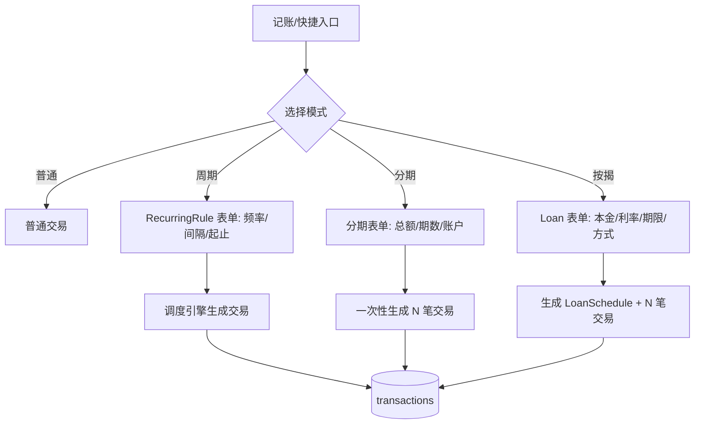
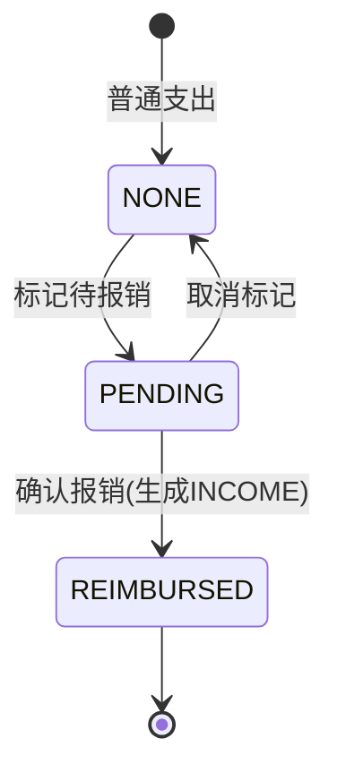

# 家庭财务 Web 应用 · 第二期需求可行性研究与 PRD

> 作者：产品经理 许清楚（Xu）
> 日期：2026-07-12
> 范围：仅做可行性研究 + 需求梳理（PRD），**不涉及代码实现**
> 配套依据：`backend/prisma/schema.prisma`、各 module 的 controller/service/dto、前端 `App.tsx` 路由与 `SettingsPage`/`Sidebar`/`QuickRecordModal`

---

## 0. 现有系统关键事实（研究基线，已核对代码）

### 0.1 数据模型（schema.prisma 已确认字段）

| 模型 | 关键字段 | 现有枚举 |
|---|---|---|
| User | id, phone*, email*, passwordHash, wechatOpenId, nickname, avatar | — |
| Family | id, name, ownerId, inviteCode, baseCurrency(默认 CNY), settings(Json) | — |
| FamilyMember | familyId, userId, role | MemberRole: OWNER/ADMIN/MEMBER/VIEWER |
| Ledger | id, familyId, ownerId?, type, name | LedgerType: **SHARED / PERSONAL** |
| Category | id, familyId, parentId?, name, icon, color, sortOrder, isSystem, rules(Json) | — |
| **Transaction** | id, ledgerId, userId, categoryId?, **type**, amount(Decimal 12,2), date, merchant?, note?, source, importRecordId?, aiConfidence?, aiCorrected, isLargeExpense, **currency(默认CNY), metadata(Json?), tags(String[])**, accountId? | TransactionType: **INCOME/EXPENSE/TRANSFER**；TransactionSource: MANUAL/QUICK_RECORD/IMPORT/VOICE |
| Account | id, familyId, ledgerId?, userId, type, name, balance, institution?, lastFourDigits?, creditLimit?, billingDay?, paymentDueDay?, availableCredit?, … | AccountType: DEBIT/CREDIT/INVESTMENT/CASH/E_WALLET/VIRTUAL |
| Budget / WishGoal / MonthlyReport / Notification / ImportRecord / ClassificationFeedback / RefreshToken | 见 schema | 各自的枚举 |

**对四模块最重要的事实：**
1. `Transaction` **没有状态字段、没有退款/报销/分期/周期的任何专用列**；但有 `metadata(Json?)` 与 `tags(String[])` 两个**预留扩展位**，以及 `accountId` 已支持账户关联。
2. 全局 `ValidationPipe` 开启 `whitelist:true, forbidNonWhitelisted:true`（`backend/src/main.ts:40`）→ **所有请求体只能含 DTO 已声明字段**，新增能力必须同步改 DTO，否则 400。
3. 数据库迁移命名 `00000000000000_<name>/migration.sql`；模型用 `@@map` 映射复数 snake_case 表名（`transactions`、`ledgers` 等）。新增表/字段需走正式迁移。
4. 后端接口风格：`/api/transactions`、`/api/ledgers`、`/api/categories`、`/api/accounts`；所有接口 `CurrentUser` 鉴权 + 按 `familyId` 隔离；**静态路由须声明在 `:id` 路由之前**（已有 `PUT /categories/reorder` 先于此 `PUT /:id` 的范例）。
5. 事件驱动已存在（`EventEmitter2`，如 `transactions.cleared`）→ 新增能力可发事件驱动前端 WebSocket 同步。
6. 前端路由（`App.tsx`）：`/dashboard /transactions /accounts /family /budget /categories /reports /notifications /settings`。设置页 `SettingsPage` 已有「数据管理」Tab，内含**占位的导出**（当前仅导出 `user` 对象的 mock）与清除交易，可作为备份/恢复的天然入口。

---

## 1. 总体结论速览（三类结论）

| 模块 | 结论 | 一句话 |
|---|---|---|
| ① 数据备份与恢复 | **已确认可行（导出）／有风险需决策（恢复）** | 导出=只读聚合，极易做；恢复=覆盖/合并策略、加密方式、ID 冲突需用户拍板 |
| ② 周期记账 / 分期 / 按揭 | **已确认可行（模型与算法）／有风险需决策（调度机制）** | 表结构与利息算法都成熟；唯一卡点是「谁来触发周期生成」 |
| ③ 交易退款与部分退款 | **已确认可行** | 增加退款关联字段 + 反向交易即可，主要工作量在统计口径改造 |
| ④ 报销交易 | **已确认可行** | 本质是「状态标记 + 关联反向收入交易 + 待报销列表」 |

> 四个模块**均无需大幅改造现有核心模型**，可通过「加列/加表/复用 metadata」实现。真正需要用户拍板的是：备份加密与恢复策略、周期任务触发方式、退款/报销对统计与预算的冲减口径。

---

# 模块①：数据备份与恢复

## 1.1 产品目标
让用户能随时把家庭财务数据**安全导出**，并在误删/换设备/换账号时**可靠恢复**，且多成员共享同一份家庭备份。

## 1.2 用户故事
- US1（家庭管理员/妻）：月底想把手家庭一年的账单导出成一份文件存到本地硬盘和网盘，防止服务器故障丢数据。
- US2（丈夫/跨设备）：换了一台新电脑/手机登录后，想把旧设备导出的备份恢复到当前账号对应的家庭里，继续记账。
- US3（管理员）：误操作清空了交易后，能用最近一次备份把数据**原样还原**，且不影响其他成员。
- US4（隐私敏感用户）：导出的文件里含金额等敏感信息，希望**用我自己的口令加密**，即使文件泄露也打不开。

## 1.3 可行性分析
- **导出（已确认可行）**：新增 `GET /api/backup/export?familyId=&scope=full` 聚合读取该 family 下的 ledgers/categories/transactions/accounts/budgets/wish_goals/monthly_reports（只读，零写入风险）。前端在「设置→数据管理」已有入口，把现有 mock 导出替换为真实接口即可。
- **恢复（有风险需决策）**：
  - 一致性风险：恢复必须**单family事务包裹**，任一步失败整体回滚，否则会出现半恢复状态。
  - ID 冲突：备份中保留了原 UUID，恢复到**同一家庭**可直接复用；恢复到**不同家庭/新账号**则必须重新生成 ID 并重建外键引用（ledgerId/categoryId/accountId 等）——这是最易出 bug 的点。
  - 覆盖 vs 合并：覆盖=先清空再插入（危险）；合并=按 ID upsert（可能重复）。需用户决策。
- **加密（有风险需决策）**：客户端口令加密（AES-GCM，密钥不落服务器）最安全但用户忘口令即永久丢失；服务端加密存储则依赖账号安全。需决策。
- **增量备份**：全量简单；增量需 `updatedAt` 游标或备份版本号，复杂度中等。

## 1.4 需求池

### P0（必须）
| 功能点 | 验收标准 | 依赖 |
|---|---|---|
| 全量导出（JSON） | 点击导出后下载包含所有家庭财务数据的 `.json`（或 `.enc`）；字段覆盖 7 类核心数据；耗时<5s（百万级需分页流式） | 读取权限校验（familyId 隔离） |
| 恢复-覆盖模式（同家庭） | 上传备份文件→二次确认→事务内清空并重建该家庭数据→返回影响条数；失败回滚 | 事务包裹、权限（OWNER/ADMIN） |
| 备份权限控制 | 仅 OWNER/ADMIN 可导出与恢复；成员可查看但不可恢复 | FamilyMember.role |

### P1
| 功能点 | 验收标准 | 依赖 |
|---|---|---|
| 客户端口令加密导出 | 导出时输入口令→文件 AES-GCM 加密；恢复时输入同一口令解密；口令永不传输到服务端 | 前端加密库（如 crypto-js/webcrypto） |
| 恢复到新家庭（ID 重映射） | 跨账号/跨家庭恢复时自动重生成所有 ID 并重建外键，不产生脏引用 | 恢复引擎设计（决策） |
| 恢复预览 | 上传后展示「将影响 N 条交易/M 个分类」再确认 | 解析器 |

### P2
| 功能点 | 验收标准 | 依赖 |
|---|---|---|
| 增量备份 | 仅导出 `updatedAt > 上次备份时间` 的数据；支持差异合并 | 增量游标策略（决策） |
| 自动周期备份 | 每月自动生成加密备份并推送通知 | 后端定时任务（见模块②调度决策） |
| 云盘/OSS 直存 | 备份直接存到用户绑定的对象存储，不下发本地 | 存储对接 |

## 1.5 UI 设计稿（文字 + 结构）
```
设置 → 数据管理（已有入口）
┌─ 外观主题 ──────────────┐
├─ 数据导出 ──────────────┤
│   [全量导出 JSON] [加密导出(口令)] │
│   最近备份：2026-07-01  ✓          │
├─ 数据恢复 ──────────────┤
│   上传备份文件 [选择文件]          │
│   ○ 覆盖当前家庭  ○ 合并          │
│   [恢复预览] → [确认恢复]          │
└─ 危险操作 ──────────────┘
```
恢复流程：选择文件 → 解密(若加密) → 解析预览 → 二次确认弹窗（输入「确认恢复」） → 事务执行 → Toast「已恢复 N 条」。

## 1.6 待确认问题清单（需用户拍板）
1. **加密方式**：客户端口令加密（密钥不离端）还是服务端托管加密？用户遗忘口令的处理策略？
2. **恢复策略**：覆盖式 / 合并式 / 仅新增？同家庭 vs 跨家庭（ID 重映射）是否都支持？
3. **增量备份**：是否需要？如何界定增量边界（updatedAt 游标 / 版本号）？
4. **存储位置**：本地下载 / OSS / 用户云盘？是否做自动周期备份？

---

# 模块②：周期记账 / 分期付款 / 按揭贷款

## 2.1 产品目标
让房租、工资等**规律发生**的收支自动生成；让一笔大额支出能**均摊为多期**；让**按揭贷款**按等额本息/本金自动生成每期还款计划。

## 2.2 用户故事
- US1（周期/妻）：每月 1 号房租 3000、每月 10 号工资 15000 自动入账，不用每月手记。
- US2（分期/网购）：用信用卡买了 6000 的手机分 12 期，每月自动记一笔 500 支出，并关联那张信用卡。
- US3（按揭/丈夫）：房贷 100 万、年利率 4.2%、30 年，系统算出每月还款额与「本金/利息」构成，自动生成 360 期计划。
- US4（一致性）：上述自动生成的交易要能一眼看出「来自哪个规则/哪期」，并支持暂停/跳期/补生成。

## 2.3 可行性分析

### 2.3.1 周期记账（Recurring）—— 模型可行，调度需决策
- 新增 `RecurringRule` 表：`ledgerId, userId, categoryId?, accountId?, type, amount, merchant?, note?, frequency(DAILY/WEEKLY/MONTHLY/YEARLY), interval, weekday?, monthDay?, startDate, endDate?, nextRunAt, isActive`。
- 生成方式三选一（**核心决策点**）：
  - A. 后端 `@nestjs/schedule` cron 定时扫 `nextRunAt<=now` 生成并推进 → 最可靠、离线也生成；但需后端常驻任务（prod/docker 已具备）。
  - B. 前端轮询/App 打开时调用「补生成」接口 → 不依赖后端调度，但用户不打开 App 就不生成。
  - C. 纯按需：用户在列表点「立即生成到期项」→ 最简单，无自动化。
- 幂等：用 `nextRunAt` 游标，生成后更新，避免重复。

### 2.3.2 分期付款（Installment）—— 已确认可行
- 复用 `Transaction`，通过新增关联字段表达分期：建议新增列 `installmentGroupId?(String)`、`installmentSeq?(Int)`、`installmentTotal?(Int)`。
- 创建分期时：建 N 笔 EXPENSE 交易（同 `installmentGroupId`，seq=1..N，date 按月递增），关联到 `accountId`（信用卡）。**零新表**，仅需迁移加 3 个可空列 + 扩展 `CreateTransactionDto`。
- 也可用 `metadata` 存分期信息做原型，但正式版建议显式列（利于查询与统计）。

### 2.3.3 按揭贷款（Mortgage）—— 已确认可行（算法成熟）
- 新增 `Loan` 表：`familyId, ledgerId, accountId?, name, principal, annualRate, termMonths, method(EQUAL_INSTALLMENT/EQUAL_PRINCIPAL), startDate, isActive`；可选 `LoanSchedule` 表存每期 `seq, dueDate, payment, principalPart, interestPart, remainingPrincipal`。
- 算法（标准、中等复杂度）：
  - 月利率 `r = annualRate/12`
  - **等额本息**：`M = P·r·(1+r)^n / ((1+r)^n − 1)`；每期利息=`剩余本金·r`，本金=`M−利息`，剩余本金递减。
  - **等额本金**：每期本金=`P/n`；利息=`剩余本金·r`；月供递减。
  - 末期做四舍五入校正，使本息之和精确等于贷款额。
- 生成：把每期还款写成一笔 EXPENSE 交易（或本金/利息拆两笔，见决策），`metadata` 记本金/利息明细，关联 `LoanSchedule`。
- 风险：利率精度（Decimal 足够）、闰月/月末日期、`termMonths` 与生成交易数一致性。

## 2.4 需求池

### P0
| 功能点 | 验收标准 | 依赖 |
|---|---|---|
| 周期规则 CRUD | 可建/改/停周期规则（日/周/月/年 + 间隔）；列表展示下次执行日 | RecurringRule 表 |
| 周期交易生成 | 按选定调度方式生成交易并推进 `nextRunAt`；不重复生成 | 调度机制（决策 A/B/C） |
| 分期付款创建 | 输入总额/期数/起始月/账户→生成 N 笔按月交易，带分组标识 | Transaction 加 3 列 |
| 按揭计划生成 | 输入本金/利率/期限/方式→生成完整还款计划表（本金/利息/剩余本金） | Loan + LoanSchedule 表、算法 |

### P1
| 功能点 | 验收标准 | 依赖 |
|---|---|---|
| 周期规则关联账户 | 生成的交易自动带 accountId（如信用卡自动扣款） | Account 模型 |
| 分期/按揭「跳过本期」「补生成」 | 单期可跳过不生成；可手动触发补生成历史漏项 | 生成引擎 |
| 还款计划可视化 | 按揭详情页展示每期本金/利息曲线与汇总 | 前端图表（已有 BarChart/LineChart） |
| 暂停/恢复 | 规则 isActive=false 时不再生成 | RecurringRule.isActive |

### P2
| 功能点 | 验收标准 | 依赖 |
|---|---|---|
| 周期规则模板库 | 房租/工资/订阅等常用模板一键建 | — |
| 提前还款 | 按揭支持提前还本并重算后续计划 | Loan 模型扩展 |
| 多币种周期 | 周期交易支持 currency≠CNY | Transaction.currency |

## 2.5 UI 设计稿（Mermaid 流程）

周期规则管理页（新增 `/recurring` 或置于 `/settings` 子页）：表格列出规则、下次执行、状态开关、操作（编辑/暂停/立即生成/删除）。

## 2.6 待确认问题清单（需用户拍板）
1. **周期任务触发方式**：后端 cron(A) / 前端轮询(B) / 纯手动(C)？直接影响可靠性与实现成本。
2. **分期/按揭产生的交易形态**：是独立多笔交易（推荐，便于统计）还是单笔+分期子表？
3. **按揭每期是否拆本金/利息两笔**：拆（利于看负债结构）还是合成一笔（简单）？
4. **信用卡分期与 Account 的联动**：分期交易是否强制绑信用卡账户并影响 `availableCredit` 计算？

---

# 模块③：交易的退款与部分退款

## 3.1 产品目标
一笔支出可**全额或部分退款**，系统记录退款关系并正确**冲减余额与统计**。

## 3.2 用户故事
- US1（妻）：买衣服 200 退货，全额退款，账单里这笔支出应被抵消。
- US2（丈夫）：下单 1000 的电脑，先退 300（部分瑕疵），剩余 700 不退；统计里只算净支出 700。
- US3（管理员）：在交易详情能看清「这笔已被退款多少、还剩多少未退」，并能追溯退款记录。
- US4（一致性）：退款不能退超原金额；多次部分退款累计不超过原额。

## 3.3 可行性分析
- **已确认可行**。推荐方案：退款=创建一笔**反向交易**（INCOME，金额=退款额），通过新增列 `refundOfId?(String)` 指向原交易；原交易用 `refundedAmount(Decimal)` 与 `refundStatus` 枚举（NONE/PARTIAL/FULL）记录累计退款。
- 校验（`transactions.service` 内）：`refundedAmount + 本次 <= 原 amount`；仅 EXPENSE 可退款；重复退款累计封顶。
- **核心风险在统计口径**：现有 `getTransactions` 统计、Dashboard、MonthlyReport 都应把退款**冲减**原支出。需统一一处聚合逻辑（建议后端 service 层统一计算「净支出」），避免散落多处算错。
- 模型改动小：Transaction 加 `refundOfId?`、`refundedAmount?`（默认0）、`refundStatus`（默认 NONE）；扩展 `CreateTransactionDto`/`UpdateTransactionDto` 加可选 `refundOfId`。

## 3.4 需求池

### P0
| 功能点 | 验收标准 | 依赖 |
|---|---|---|
| 退款/部分退款 | 交易详情点「退款」→输入金额→生成反向 INCOME 并关联交易；校验不超原额 | Transaction 加 3 列 |
| 退款状态展示 | 原交易显示「已退 X / 共 Y」「全额/部分」标签 | refundStatus |
| 统计冲减 | Dashboard/月报/筛选的支出合计 = 原支出 − 退款额 | 聚合逻辑统一改造 |

### P1
| 功能点 | 验收标准 | 依赖 |
|---|---|---|
| 多次部分退款 | 同一笔可分多次退，累计≤原额；每次生成独立反向交易 | 校验逻辑 |
| 退款撤销 | 误退可撤销（删反向交易并回滚 refundedAmount） | 事务 |
| 退款记录列表 | 原交易下展开查看所有退款明细 | — |

### P2
| 功能点 | 验收标准 | 依赖 |
|---|---|---|
| 退款通知 | 退款到账推送通知 | Notification |
| 跨账本退款 | 退款进入与原支出不同账本/账户 | 账户联动 |

## 3.5 UI 设计稿（结构）
```
交易详情弹窗（已有 EditTransactionModal 扩展）
┌─ 金额：-200 餐饮（已退 200/200 ✓ 全额） ─┐
│  关联退款：                               │
│   · 2026-07-05 +200（部分）              │
│   · 2026-07-10 +0  （剩余可退 0）        │
│  [+ 发起退款]  （输入金额，默认全额）     │
└──────────────────────────────────────────┘
```
列表页增加筛选「仅看有退款 / 仅看未退完」。

## 3.6 待确认问题清单（需用户拍板）
1. **退款对统计的口径**：是「支出合计 = 原额 − 退款」（净口径，推荐）还是「支出/退款分别展示不冲减」？
2. **退款是否生成新反向交易**：推荐生成（可审计）；还是直接改原交易金额（简单但破坏审计）？
3. **退款与预算**：退款是否回补当月预算额度？
4. **退款账户归属**：退款进原支出账户，还是可指定其他账户？

---

# 模块④：报销交易

## 4.1 产品目标
员工垫付后向家庭/公司报销，支持「待报销→已报销→到账」状态流转，并关联原始交易。

## 4.2 用户故事
- US1（丈夫/出差）：出差自掏 2000 打车，标记「待报销」，月底公司向家庭账本报销到账。
- US2（妻/家庭采购）：帮家庭垫付 500 买菜，标记待报销，随后从家庭共同账户「报销」给自己。
- US3（管理员）：在「待报销」清单一眼看到谁垫了多少、还差多少没报。
- US4（清晰区分）：报销与「退款」是不同概念（退款是商家退钱，报销是公司/家庭补回），统计上不能混。

## 4.3 可行性分析
- **已确认可行**。本质 = 「状态标记 + 关联反向 INCOME 交易 + 待报销列表」。
- 新增列 `reimbursementStatus`（NONE/PENDING/REIMBURSED）与 `reimbursementOfId?`（原支出→报销收入交易）；或复用 `tags`+`metadata` 做原型，正式版建议显式列。
- 流程：标记 PENDING（不创建交易，仅状态）→ 报销时创建一笔 INCOME（来源可记为 REIMBURSE），设原交易为 REIMBURSED，关联 `reimbursementOfId`。「到账」=该 INCOME 的 date。
- **风险/注意**：报销与退款都产生反向 INCOME，必须靠 `reimbursementStatus` / `refundOfId` 区分，统计时分别处理，避免重复冲减或误冲减。
- 前端：新增「待报销」视图（可在 `/transactions` 加 Tab，或独立 `/reimbursements` 页）。

## 4.4 需求池

### P0
| 功能点 | 验收标准 | 依赖 |
|---|---|---|
| 标记待报销 | 交易详情「标记为待报销」→状态 PENDING；待报销清单可见 | Transaction 加 2 列 |
| 确认报销 | 对待报销项点「报销」→生成 INCOME 交易并关联，状态 REIMBURSED | — |
| 待报销清单 | 按成员/状态筛选，展示待报销总额 | 列表页扩展 |

### P1
| 功能点 | 验收标准 | 依赖 |
|---|---|---|
| 报销来源区分 | 报销来自「家庭共同账户」或「公司/外部」可标注 | 来源字段 |
| 批量报销 | 多选待报销项一次性报销 | 批量操作（已有 batch 机制） |
| 报销统计 | 月报/仪表盘展示「待报销/已报销」汇总，不与退款混淆 | 聚合改造 |

### P2
| 功能点 | 验收标准 | 依赖 |
|---|---|---|
| 报销审批流 | 家庭成员提交→管理员审批→到账（谁审批可配） | 权限 |
| 公司报销对接 | 对接外部公司报销系统（导出明细） | 外部集成 |

## 4.5 UI 设计稿（Mermaid）

待报销页（表格）：交易 | 垫付人 | 金额 | 状态 | 操作[报销/取消]。

## 4.6 待确认问题清单（需用户拍板）
1. **报销来源**：仅家庭共同账户，还是也含「公司/外部」报销？影响账本/账户归属。
2. **报销到账方式**：自动生成 INCOME 交易（推荐）还是仅标记不生成交易？
3. **与退款的展示区分**：统计/清单如何区分「退款」与「报销」避免混淆？
4. **是否需要审批流**：家庭成员报销是否需 OWNER/ADMIN 审批？

---

# 2. 跨模块共性结论与建议

## 2.1 模型扩展汇总（落地时统一迁移）
| 模块 | 新增表 | Transaction 新增列 | 新增枚举 |
|---|---|---|---|
| ①备份 | （可选）BackupRecord | — | — |
| ②周期/分期/按揭 | RecurringRule；Loan；LoanSchedule | installmentGroupId?, installmentSeq?, installmentTotal? | Frequency(DAILY/WEEKLY/MONTHLY/YEARLY)；LoanMethod |
| ③退款 | — | refundOfId?, refundedAmount?, refundStatus | RefundStatus(NONE/PARTIAL/FULL) |
| ④报销 | — | reimbursementStatus, reimbursementOfId? | ReimburseStatus(NONE/PENDING/REIMBURSED) |

> 所有新增列均设默认值/可空，**不破坏现有 `CreateTransactionDto`**（保持向后兼容，满足 `whitelist` 约束）。分期/退款/报销的原始交易都不删，只在 `metadata` 或新列记录关联，保证审计链完整。

## 2.2 必须统一的统计层改造（最高优先级风险）
退款（③）与报销（④）都会产生「反向 INCOME」，且都影响支出/余额。建议在 `TransactionsService` 聚合层**统一计算「净支出 = 原支出 − 退款」**，并在 Dashboard、MonthlyReport、预算消耗三处共用同一口径，避免散落计算导致数据不一致。这是四个模块里**唯一会牵动既有统计逻辑**的点，需在开发排期里单列。

## 2.3 调度机制（模块②核心决策，建议尽早拍板）
周期/按揭的「自动生成」依赖调度。后端 `@nestjs/schedule`（方案 A）最稳，但需确认 prod 容器允许常驻定时任务；若不愿引入后端调度，则用「前端打开时补生成」（方案 B）作为兜底。建议：**P0 先做方案 C（手动/按需生成）+ 预留方案 A 接口**，降低首期风险。

## 2.4 待用户拍板的总清单（合并）
1. 备份**加密方式**与**恢复策略**（覆盖/合并/跨家庭 ID 重映射）。
2. 备份是否做**增量**与**自动周期备份**。
3. 周期任务**触发方式**（后端 cron / 前端轮询 / 手动）。
4. 分期/按揭交易**形态**（独立多笔 vs 单笔+子表）与按揭**本金利息是否拆分**。
5. 退款对**统计/预算的冲减口径**。
6. 报销**来源**（家庭/公司）与是否需**审批流**。

---

## 3. 优先级建议（给 team-lead 排期参考）
- **P0 首批**：③退款（模型小、价值高、见效快）→ ④报销（复用退款的关联交易模式）→ ②分期+按揭生成（算法成熟）→ ①全量导出+覆盖恢复。
- **P1**：②周期调度（依赖决策）、①加密导出、③统计冲减统一、④待报销清单。
- **P2**：①增量/自动备份、②提前还款、④审批流。
- **横切必做**：统计层「净支出」统一改造（伴随 ③④ 一起上线）。

> 注：本文档为产品可行性研究与 PRD，**不含任何代码、未修改任何源文件**。所有表/字段/枚举为建议方案，最终以开发期迁移与 DTO 落地的实现为准。
